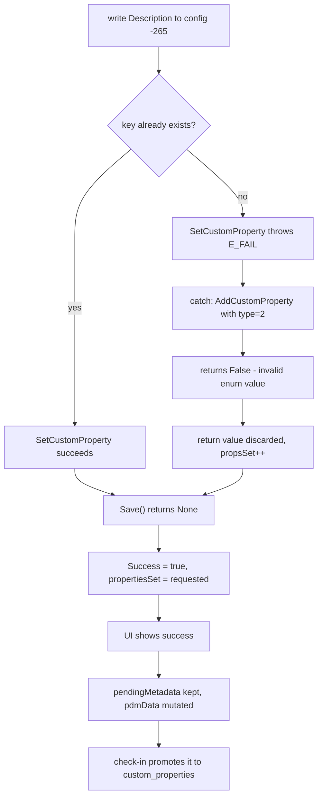

# Rock-solid SolidWorks metadata

## The root cause, measured

`swDmCustomInfoText` is **30**. Production passes **2**, which is not a member of `SwDmCustomInfoType` at all.

```
swDmCustomInfoUnknown = 0    swDmCustomInfoNumber = 3     swDmCustomInfoYesOrNo = 11
swDmCustomInfoText    = 30   swDmCustomInfoDate   = 64    swDmCustomInfoEquation = 105
```

```1467:1467:solidworks-service/BluePLM.SolidWorksService/DocumentManagerAPI.cs
                var swDmCustomInfoTextEnum = customInfoType != null ? Enum.ToObject(customInfoType, 2) : (object)2;
```

The same line appears again at `:1679`. `AddCustomProperty` rejects the invalid type and returns `false`; `InvokeAddCustomProperty` discards the return value; `propsSet++` runs anyway; `Save()` returns success because the save itself did succeed - there was simply nothing new in it.

This was verified end to end on the fixture with `--dm-probe --allow-write`, writing to a `.bak`-protected copy and re-reading through a **second** Document Manager application:

| Probe | Result | Read-back |
|---|---|---|
| file-level `SetCustomProperty`, existing key | no throw | **PASS** |
| file-level `SetCustomProperty`, new key | throws `E_FAIL` | absent |
| file-level `AddCustomProperty`, **type 2** (production) | returns **False** | absent |
| file-level `AddCustomProperty`, **type 30** | returns **True** | **PASS** |
| config-level `SetCustomProperty`, existing key | no throw | **PASS** |
| config-level `SetCustomProperty`, new key | throws `E_FAIL` | absent |
| config-level `AddCustomProperty`, **type 2** (production) | returns **False** | absent |
| config-level `AddCustomProperty`, **type 30** | returns **True** | **PASS** |

`Save()` returned `swDmDocumentSaveErrorNone` in every case. The file hash changed, because the two existing-key updates did land. Verdict: `DM_CREATE_BROKEN_BY_INFOTYPE_CONSTANT`.

Three consequences follow, and they overturn most of the previous diagnosis.

**Document Manager was never the problem, and config level was never special.** DM updates and creates properties correctly at both scopes once it is given a valid type. The comment at `Program.cs:862-863` claiming "the DM API's AddCustomProperty silently fails for config-level properties" is wrong about the API and wrong about the scope. It fails for **new keys at any scope**. It looked configuration-specific because file-level keys already exist on these template parts while each configuration routinely needs a key created for the first time.

**The 3.14.0 removal and 3.21.0 partial re-enable of the DM write path could never have helped.** Both branches shared the bad constant. That is the whole round trip explained.

**The failure was invisible by construction.** `AddCustomProperty` reported the failure honestly, on every single call, for the entire life of the bug. Nobody read it.

### The secondary defect that hid it

`DescribeOpenError` is shifted by one from code 2 onward:

| Code | Interop defines | `DocumentManagerAPI.cs:2613-2622` reports |
|---|---|---|
| 2 | `NonSW` | "file not found" |
| 3 | `FileNotFound` | "file is read-only" |
| 4 | `FileReadOnly` | "not a native SolidWorks file" |
| 5 | `NoLicense` | "file is open in another application" |
| 6 | `FutureVersion` | correct |

Measured directly: forcing the read-only attribute on and opening for write returns code **4**, which production prints as *"not a native SolidWorks file"*. BluePLM marks every unchecked-out vault file read-only (`electron/handlers/fs.ts:2407`), so this is a routine production state that logs as a file-format error. That is almost certainly where the "newer SLDPRT versions / file format" theory came from, and it is also why a missing DM license shows up as a phantom file lock.



The last two nodes are why this is not merely cosmetic. The unwritten value is persisted to the database at check-in, so the database and the file diverge permanently and the UI keeps showing a value the file never had.

---

## Audit verdicts on the previous plan

| # | Previous claim | Verdict |
|---|---|---|
| 1 | Writes are structurally incapable of reporting failure | **CONFIRMED**, and it is the reason the real bug survived |
| 2 | "DM silently fails for config-level properties" was a misdiagnosis | **CONFIRMED by measurement**, though for a different reason than argued - an invalid enum constant, not a missing return check alone |
| 3 | Routing to Document Manager by default removes the UI popups | **PARTIAL** - right direction, wrong mechanism for the lock check |
| 4 | The property contract is reimplemented in nine places and they disagree | **CONFIRMED** |
| 5 | Deriving the configuration from the drawing filename suffix fixes inference | **REFUTED** - only 2 of 11 drawings on the fixture can ever match |

One correction to the audit itself: the audit argued the `catch` around `SetCustomProperty` was dead code because `SetCustomProperty` returns `void` and would not throw on a missing key. It does throw - `E_FAIL` - so the fallback is reached on every create. That makes the constant the sole point of failure rather than one of two.

The largest source of metadata corruption is still **not** in the original plan: two code paths overwrite good per-configuration data with worse data on the success path. Those are phase C.

---

## Test isolation (hard constraint)

Every write during this work touches exactly one file:

```
C:\BluePLM\br-vault\0 - SHARED\00 - REGRESSION TESTS\ORING-BUNA-70A.SLDPRT
```

The `--dm-probe` harness enforces this in code: write mode refuses any path not containing `00 - REGRESSION TESTS`, copies to `.bak` before touching anything, restores in a `finally`, and verifies the restore by SHA-256. Verified across four write runs - the fixture ends byte-identical at `213228DF...` with its original read-only attribute.

Corrections to the fixture description carried by the previous plan:

- The part has **68 configurations**, not 84 and not 11. The 11 figure was the drawing count.
- Configuration names are not clean suffixes. They mix bare dash-numbers (`-265`, `-013`), prose (`Installed WTE8 Radial`, `Streched nom Oring 1`), and reversed dimension strings (`1.5X33-518`).
- The first configuration is `XXX`, a template whose properties are identical to the file-level set (`Number = BR-100635-XXX`, `Tab Number = -XXX`). Any "pick the first configuration" fallback lands on the template.

`00 - REGRESSION TESTS\BAR30\BAR30\BAR30\...` is a pre-existing self-nesting directory about 35 levels deep that overflows MAX_PATH, so no recursive operations under that folder.

---

## Design rules

1. A write is not complete until it has been read back and matched, through a **fresh** Document Manager application, cross-checked against the file hash. Verification never touches the SolidWorks UI.
2. Failure propagates. A failed or unverified write rolls back the optimistic state that anticipated it.
3. Every enum value crossing the COM boundary is a named member of its enum, never a hardcoded integer.
4. The property contract lives in exactly one place. Every reader and writer calls it, in both languages.

---

## Phase A - Measurement (complete)

The probe lives at `solidworks-service/BluePLM.SolidWorksService/DmWriteProbe.cs`, wired as `--dm-probe`. It never constructs a `SldWorks.Application` and never calls into `SolidWorksAPI`, so it cannot make a SolidWorks window appear; it detects competing file holders with a `FileShare.None` open rather than COM.

```powershell
# inventory only
.\BluePLM.SolidWorksService.exe --dm-license "<key>" --dm-probe "<fixture>"

# full write / read-back / restore
.\BluePLM.SolidWorksService.exe --dm-license "<key>" --allow-write --probe-config "-265" --dm-probe "<fixture>"

# what Save() does when the vault has marked the file read-only
.\BluePLM.SolidWorksService.exe --dm-license "<key>" --allow-write --probe-readonly --probe-config "-265" --dm-probe "<fixture>"
```

Results are in the root-cause section above. Two environment facts worth keeping:

- Two Document Manager interops are installed: `SOLIDWORKS (2)\...` at **34.3.2.3** (2026) and `SOLIDWORKS\...` at **32.5.0.48** (2024). The app is configured with `swProgId: SldWorks.Application.32`, and `FallbackDllSearchPaths` hardcodes the un-suffixed path, so interop selection is version-sensitive on this machine even though it resolved to 34.3.2.3 here. Worth asserting explicitly rather than leaving to registry ordering.
- The fixture opens cleanly under DM 34 with error 0. The future-version theory is not in play for this file.

### A3. Extend the probe into the regression harness

Widen from one configuration to a sentinel sweep: write known values to every configuration, read back through every read path, assert exact equality, restore from `.bak`. Run it before changing anything else and keep it as the gate for every later phase.

It must cover all five recurring bug themes, which the previous step 1 would not have caught. Add cases for: a key that exists at file level but not config level and vice versa (the create path, which is the actual bug); a value containing `$PRP:`; an empty value, which takes the delete path at `DocumentManagerAPI.cs:1481`; a configuration whose name matches no drawing suffix; and a write attempted while the read-only attribute is set.

---

## Phase B - Fix the constant, then stop lying

### B1. The one-line fix

Replace `Enum.ToObject(customInfoType, 2)` with the named `swDmCustomInfoText` member at `DocumentManagerAPI.cs:1467` and `:1679`, resolving it by name from the loaded enum rather than by integer so a future interop change cannot silently reintroduce this. Drop the `(object)2` raw fallback: if the enum type cannot be resolved, fail loudly instead of guessing a value that is known not to work.

Correct `DescribeOpenError` at `:2613-2622` to the real `SwDmDocumentOpenError` values, and audit the two hand-written error codes in `GetDocumentInternal` (`:681` sets `2` with a comment claiming `FileNotFound`, which is actually `NonSW`).

Ship this with the read-back verification from B3, not before it - a fix that cannot prove itself is how this bug lasted three releases.

### B2. Make writes report the truth

In [DocumentManagerAPI.cs](solidworks-service/BluePLM.SolidWorksService/DocumentManagerAPI.cs), have `InvokeAddCustomProperty` return the COM bool and treat `false` as a failure, and check the result of `Save()` against `SwDmDocumentSaveError`.

In [SolidWorksAPI.cs](solidworks-service/BluePLM.SolidWorksService/SolidWorksAPI.cs), change `WriteCustomProperties` from `void` to a per-property outcome, keep the existing `Set2` check, stop swallowing the `Add3` exception, and check the `errors` out-param from `Save3`. Apply the same to `SetDocumentProperties` (`:4393`), the path taken whenever the file is already open in SolidWorks, which the previous plan missed.

In [Program.cs](solidworks-service/BluePLM.SolidWorksService/Program.cs), replace `Success = success > 0` in `SetPropertiesBatchFast` with a per-configuration result set, and replace `propertiesSet = properties.Count` with the count actually written.

In [DetailsPanel.tsx](src/features/source/details/DetailsPanel.tsx), stop discarding the `setProperties` result at `:436-441`.

### B3. Read-after-write verification

After the save, reopen and compare every written property against intent, reporting mismatches by property and configuration. Three signals together, because asking the layer that wrote whether the write worked is what failed here:

1. Re-read through a **new** `SwDMApplication`, not just a new document handle.
2. Confirm the file's SHA-256 changed.
3. Confirm `Save()` returned `swDmDocumentSaveErrorNone`.

`VerifyDrawingReference` at `DocumentManagerAPI.cs:2814` already establishes this pattern for reference rewrites; generalise it to properties. When the document is already open in SolidWorks, verify through the handle already held rather than opening anything new.

### B4. Honest reporting in the app layer

Treat any `failCount > 0` as a failure at `syncMetadata.ts:929` rather than only `failCount === configs.length`, fix the catch at `:939` that returns success after config writes failed, and stop counting a `null` return from `pullDrawingMetadata` as a success in the command's tally.

---

## Phase C - Stop destroying data

None of this was in the previous plan. Unlike everything above, it corrupts data on the **success** path, so fixing phase B will make it more visible, not less.

### C1. `pushPartAssemblyMetadata` overwrites every configuration

`syncMetadata.ts:767-948` builds `configTabs` and `configDescs` from `pendingMetadata` **only**, then writes that set to every configuration. Configurations holding valid config-specific values and no pending edit get overwritten with file-level or empty values. On this fixture, editing one configuration rewrites all 68.

The write set must be per-configuration and must start from what the file currently holds. Configurations with no pending change must not appear in the write at all.

### C2. `useConfigHandlers` writes back its own guesses

The loader at `useConfigHandlers.ts:1286-1348` derives `description` by merging file-level and config-level properties and derives `tabNumber` by splitting `Number`. Those derived values flow into the save path at `:789`, where `config.description ?? baseDesc` substitutes the file-level description when the config-level one is empty. A read-modify-write cycle whose read is a heuristic converges on the heuristic's output - the observed "description reverts to the parent's" behaviour.

The fixture shows exactly this shape already: file-level `Description` and config `-265`'s `Description` are both `O-ring, NBR 70A, Family`, and config `-265` differs from the file-level set only in `Tab Number`. A merge-on-read followed by a write-back cannot distinguish "inherited" from "set deliberately".

Loaded values must record their provenance, and only file-sourced values may be written back. An absent config description must stay absent.

This loop also issues one `getProperties` per configuration - 68 IPC round trips on expand - which the batch read in C3 removes.

### C3. `setPropertiesBatch` is not a batch

`SetPropertiesBatchFast` (`Program.cs:886-906`) loops over configurations calling `_swApi.SetCustomProperties` once each, so 68 configurations means 68 `OpenDoc6`/`Save3`/`CloseDoc` cycles against a 60-second timeout (`solidworksErrors.ts:206`). `DocumentManagerAPI.SetCustomPropertiesBatch`, which does do one open/save cycle, exists and has **zero callers**.

Now that DM is known to write both scopes correctly, adopting that method is the straightforward fix. The probe demonstrates the shape: eight property operations across both scopes in a single open/save cycle.

### C4. Timeout retries duplicate mutating commands

The Electron queue runs `SW_MAX_CONCURRENT_COMMANDS = 1` (`electron/handlers/solidworks.ts:49`). When `setPropertiesBatch` exceeds its timeout the renderer falls back to individual `setProperties` calls while the original batch is still executing in the service, interleaving two mutating streams on one file.

A timeout must not retry a mutating command whose outcome is unknown. Either wait for the original to be confirmed dead, or carry an idempotency token the service deduplicates on.

### C5. Roll back optimistic state on failure

`updatePendingMetadata` (`filesSlice.ts:574-671`) mutates `pdmData` optimistically alongside `pendingMetadata`, and nothing reverts either when the write fails. Check-in then promotes `pendingMetadata` into `custom_properties` (`checkin.ts:151-177`) while explicitly not writing to the SolidWorks file (`checkin.ts:1123-1124`), so an unwritten value becomes the database's truth.

A write that fails or cannot be verified must revert both the pending entry and the optimistic `pdmData` mutation. Check-in must not promote an unverified pending value into `custom_properties`.

---

## Phase D - One property contract

Create a single module owning the read-priority key list, the `$PRP:` guard, the config-selection rule, and a `buildItemNumberProperties(base, tab, description, revision, settings)` that every writer calls. Route [syncMetadata.ts](src/lib/commands/handlers/syncMetadata.ts), [DetailsPanel.tsx](src/features/source/details/DetailsPanel.tsx), [SolidWorksPanel.tsx](src/features/integrations/solidworks/SolidWorksPanel.tsx) and [useConfigHandlers.ts](src/features/source/browser/hooks/useConfigHandlers.ts) through it, and have the C# side consume the same key list as data rather than a fifth copy.

The confirmed disagreements this closes:

- `SolidWorksPanel` writes only `Base Item Number` (`:1066-1112`), which every reader deprioritises below `Number`. The fixture carries both, set to the same value, so the divergence is currently latent rather than visible - it becomes a live bug the moment they differ.
- `DetailsPanel` writes `Number` and leaves a stale `Base Item Number`.
- `SolidWorksPanel`'s reader lacks the `$PRP:` guard at `:1024`, so it can still store `$PRP:"Number"` as a part number - the 3.7.0 bug, still reachable. The fixture's `Volume` and `Weight` properties hold exactly this shape of value (`"SW-Mass@ORING-BUNA-70A.SLDPRT"`), so unguarded readers have live inputs to trip on.
- `Description` is read from a custom property in some paths and from the native `Configuration.Description` field in others (`SolidWorksAPI.cs:1535-1579`). The contract must name one as authoritative.

Also fold in the drawing-revision inconsistency: `pushDrawingMetadata` never writes revision (`syncMetadata.ts:1016-1061`) while `pushPartAssemblyMetadata` writes it per configuration.

---

## Phase E - Routing and inference

No longer gated: the measurement confirms Document Manager handles both scopes, so DM-by-default is sound once B1 lands.

### E1. One routing policy

Replace the eight independent DM-vs-COM decisions with a single chooser that all `*Fast` handlers call. This fixes the four actions still broken when COM is unreachable - `getBom`, `setProperties`, `setPropertiesBatch`, and `duplicateWithReferences`, the last of which currently returns a false `FILE_OPEN_IN_SOLIDWORKS`.

Replace the guessed `true` at `SolidWorksAPI.cs:823`. The previous plan proposed a `~$` lock file check; SolidWorks does not reliably create those and stale ones survive crashes. Use the ROT probe already in the codebase (`TryReadWhileOpenInSolidWorks`, `Program.cs:498-524`), falling back to a `FileShare.None` open, which answers the same question with no COM and no possibility of a UI appearing. The probe uses this and it correctly reported the fixture as unheld while SolidWorks 2024 was running.

Pin interop selection explicitly rather than relying on registry ordering, given two versions are installed.

### E2. Stop swallowing the COM exception

Add `catch (SolidWorksComInaccessibleException) { throw; }` ahead of the general catch in `SetCustomProperties` (`:1373`), `GetBillOfMaterials` (`:1092`) and `DuplicateViaPackAndGo` (`:3236`), so `ProcessCommand` can map it to the typed wire code.

### E3. Delete the inference path - Document Manager already knows

The inference path added in 3.24.0 guesses:

```691:694:src/lib/commands/handlers/syncMetadata.ts
        const preferredConfig =
          parentConfigNames.find((k) => k.toLowerCase() === 'default') ||
          parentConfigNames.find((k) => k.toLowerCase() === 'standard') ||
          parentConfigNames[0]
```

Neither `default` nor `standard` exists on this part, so all 11 drawings fall through to `parentConfigNames[0]`, the `XXX` template. Every drawing inherits template values.

The previously proposed fix - matching the drawing filename suffix to a configuration name - was measured against the real names and recovers only 2 of 11. Six others are the same o-ring with the dimension pair written in the opposite order (`-33X1.5` versus `1.5X33-518`), which no suffix comparison recovers.

**None of that work is necessary.** `ISwDMView.ReferencedConfiguration` returns the correct configuration headlessly, measured on the fixture with SolidWorks untouched:

```
ORING-BUNA-70A-265.SLDDRW     3 views -> doc=ORING-BUNA-70A.sldprt  config=-265
ORING-BUNA-70A-33X1.5.SLDDRW  2 views -> doc=ORING-BUNA-70A.sldprt  config=1.5X33-518
```

The second row is exactly the case declared unrecoverable by filename. Document Manager has the answer stored in the view.

So E3 is not "improve the heuristic", it is **delete the heuristic**. Read the referenced configuration from the drawing views and decline only when the views genuinely do not name one. This depends on `GetDrawingViewReferences` from the [headless reference reads](.cursor/plans/headless-reference-reads.plan.md) plan; do not build a second copy here.

Note for that work: `ReferencedDocument` returns a bare filename with a lowercase extension (`ORING-BUNA-70A.sldprt`), not a full path, so it must be resolved against the search paths.

The conflict flagged in the previous revision - "DM-first routing removes the only reliable source of ReferencedConfiguration" - is **refuted**. `SolidWorksAPI.cs:1134-1221` is not the only source; DM supplies it without a SolidWorks process.

---

## Phase F - Cleanup and release

Delete the uncalled `DocumentManagerAPI.GetPartNumber` and `GetRevision`, which carry pre-3.5.0 key ordering. Adopt `SetCustomPropertiesBatch` in C3 or delete it. Strip the `#region agent log - Hypothesis` scaffolding in `syncMetadata.ts` and `Program.cs` that logs every property name and the first twenty values of every parent read at info level on every drawing sync.

Bump `SERVICE_VERSION` and `EXPECTED_SW_SERVICE_VERSION` in [swServiceVersion.ts](src/lib/swServiceVersion.ts) with a description entry, add a CHANGELOG entry recording that the DM config-write limitation never existed, rebuild, and run `npm run typecheck`. The A3 harness must pass with SolidWorks closed, with the part open in SolidWorks, and with the ROT broken, and the part must end byte-identical to its `.bak`.

---

## Ranked risks

| Rank | Risk | Where |
|---|---|---|
| 1 | Invalid info-type constant makes every Document Manager property create fail silently | B1 |
| 2 | Per-config data overwritten with file-level or pending-only values on the success path | C1 |
| 3 | Loader-derived description and tab number written back as if authoritative | C2 |
| 4 | Failed write leaves pendingMetadata and pdmData claiming success; check-in persists it to the database | C5 |
| 5 | Open-error decoder reports read-only files as "not a native SolidWorks file" and missing licenses as file locks | B1 |
| 6 | 68-config batch is N open/save cycles against a 60s timeout | C3 |
| 7 | Timeout retry runs a second mutating command against a file still being written | C4 |
| 8 | All 11 drawings inherit the `XXX` template configuration | E3 |
| 9 | Interop selection between two installed DM versions left to registry ordering | E1 |
| 10 | Reference resolution returns nothing for every file, forcing SolidWorks escalation | separate plan, see below |

## Relationship to the headless reference reads plan

[Headless reference reads](.cursor/plans/headless-reference-reads.plan.md) is a **different bug of the same species**, in the same file, and its root cause was verified against the installed interops during this work.

| | This plan | Headless reference reads |
|---|---|---|
| Wrong constant | `SwDmCustomInfoType` 2, should be 30 | `SwDmSearchFilters` 15 and 3, should be 113 |
| Discarded signal | `AddCustomProperty` returns `false` | `GetAllExternalReferences4` broken-refs out-param |
| Symptom | property creates silently do nothing | reference reads return empty |
| Escalation that hides it | reported as success | falls back to `OpenDoc6`, windows appear |

Measured on `ORING-BUNA-70A-265.SLDDRW`: filters 15 and 3 return **0** references, filters 16 and 113 return **1** (`ORING-BUNA-70A.SLDPRT`). Verdict `REFERENCES_BROKEN_BY_SEARCH_FILTER`. Both interops define the enum identically, so this is not version-sensitive.

Three points of coordination:

1. **One chooser, not two.** That plan's escalation tiers and this plan's E1 routing policy are the same component. Whichever ships second adopts the other's.
2. **That plan's stated dependency is overstated.** It claims this plan's read-after-write verification "is only true once Document Manager actually works, so this lands first." Property read-back through DM works today - it was measured end to end here with SolidWorks running and no window shown. The search-filter bug affects reference resolution only. B1 through B3 can ship independently and in either order.
3. **The real dependency runs the other way.** E3 here should consume `GetDrawingViewReferences` from that plan rather than building any configuration heuristic.

Also: that plan proposes `HasSolidWorksLockFile` for the guessed `true` at `SolidWorksAPI.cs:823`, carried over from an earlier revision of this plan. This revision drops that idea in favour of the ROT probe plus a `FileShare.None` open, for the reasons in E1. Build it once, that way.

## Known follow-up, deliberately not in scope

`SolidWorksAPI.cs` (215 KB) and `DocumentManagerAPI.cs` (183 KB) are far past the "must be split before adding new functionality" tier in the workspace rules, and their size is a direct contributor to fixes landing in one file and not the other. Splitting them is separate work; bundling it here would make this change unreviewable.
