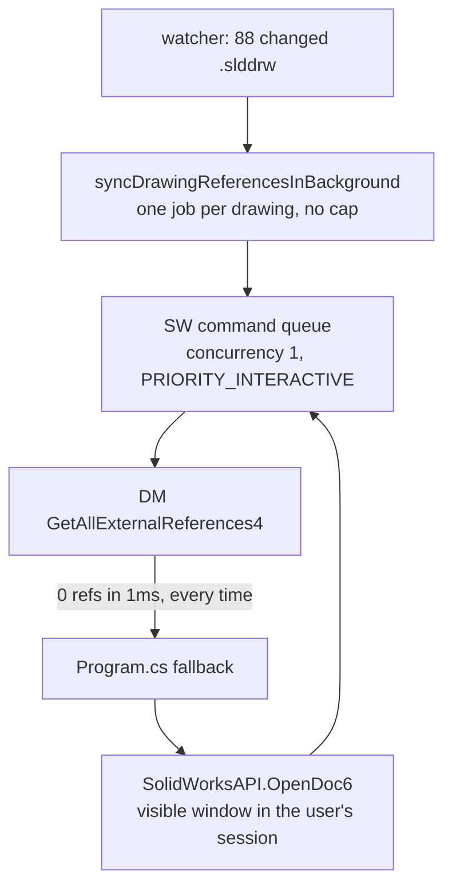

# Headless reference reads

## Verified against the installed interops

Every claim in this plan's root cause was independently confirmed by reflecting the installed
`SolidWorks.Interop.swdocumentmgr.dll` and by running the reference read against the regression
fixtures with SolidWorks untouched. Results are inlined below where they apply. Three things changed
as a result: the dependency on the metadata plan is smaller than stated, the open question about
`ReferencedDocument` is answered, and step 4 turns out to solve a problem the metadata plan was
separately trying to solve with a heuristic.

## What actually happened to Rai

At `22:30:30` the vault watcher reported 88 changed files in `CABLE\DEVELOPMENT`. Five seconds later all 88 were sitting in the SolidWorks command queue:

```
[22:30:30.288] File changes detected: 88 files
[22:30:35.287] [SolidWorks Queue] [WARN] HIGH QUEUE DEPTH: 19 pending commands!
```

Every one of them opened a document in SolidWorks. The log contains 92 `getReferences` calls and 88 `[SW-API] GetExternalReferences: Drawing detected, traversing views` lines, totalling 145,562 ms of SolidWorks time at an average of 1,582 ms each. That is Rai's "around 3 minutes", one drawing visible for a few seconds at a time.



## Root cause

`DocumentManagerAPI.CreateReferenceSearchOption` configures every Document Manager reference lookup in the service:

```229:236:solidworks-service/BluePLM.SolidWorksService/DocumentManagerAPI.cs
        private object? CreateReferenceSearchOption(IEnumerable<string?> searchPaths, int searchFilters = 15)
        {
            var searchOpt = CreateSearchOptionObject();
            if (searchOpt == null) return null;

            dynamic dynSearchOpt = searchOpt;
            dynSearchOpt.SearchFilters = searchFilters;
```

The doc comment above it names the four flags correctly and then assigns them the wrong values:

```223:227:solidworks-service/BluePLM.SolidWorksService/DocumentManagerAPI.cs
        /// Build a search option object configured for resolving external references.
        /// Default filters are SwDmSearchExternalReference | SwDmSearchRootAssemblyFolder |
        /// SwDmSearchSubfolders | SwDmSearchInContextReference (1 + 2 + 4 + 8).
        /// Note these are search BEHAVIOUR flags, not document TYPE flags.
```

Read straight out of the installed `SolidWorks.Interop.swdocumentmgr.dll`, `SwDmSearchFilters` is
(**verified identical in both installed interops, v32.5.0.48 and v34.3.2.3, so this is not
version-sensitive**):

- `SwDmSearchSubfolders` = 1
- `SwDmSearchForPart` = 2
- `SwDmSearchForDrawing` = 4
- `SwDmSearchForAssembly` = 8
- `SwDmSearchExternalReference` = 16
- `SwDmSearchInContextReference` = 32
- `SwDmSearchRootAssemblyFolder` = 64
- `SwDmSearchPartToBaseAssemblyReference` = 128

So `15` means `Subfolders | ForPart | ForDrawing | ForAssembly`. **`SwDmSearchExternalReference` (16) is not set.** Document Manager is being told which document *types* to match and never told to search for external references at all. The four flags the comment names actually sum to **113**, which is exactly what every SOLIDWORKS Document Manager sample uses:

```23:23:codestack/solidworks-document-manager-api/document/replace-references/Macro.vba
    searchOpts.SearchFilters = SwDmSearchFilters.SwDmSearchExternalReference + SwDmSearchFilters.SwDmSearchRootAssemblyFolder + SwDmSearchFilters.SwDmSearchSubfolders + SwDmSearchFilters.SwDmSearchInContextReference
```

The log shows the consequence precisely: `GetAllExternalReferences4 via ISwDMDocument19 returned 0 refs` and `GetAllExternalReferences took 1ms, found 0 refs`. Not slow, not erroring — instantly empty, because it was asked the wrong question.

**Measured directly** on `00 - REGRESSION TESTS\ORING-BUNA-70A-265.SLDDRW`, read-only, SolidWorks never touched:

```
filters=15   Subfolders|ForPart|ForDrawing|ForAssembly (production default)   -> 0 refs
filters=3    Subfolders|ForPart (production, second call site)                -> 0 refs
filters=16   ExternalReference only                                           -> 1 ref  ORING-BUNA-70A.SLDPRT
filters=113  ExternalReference|InContextReference|RootAssemblyFolder|Subfolders -> 1 ref  ORING-BUNA-70A.SLDPRT
```

Same result on `ORING-BUNA-70A-33X1.5.SLDDRW`. Verdict `REFERENCES_BROKEN_BY_SEARCH_FILTER`. The
harness for this is `--dm-probe --probe-references` in
[DmWriteProbe.cs](solidworks-service/BluePLM.SolidWorksService/DmWriteProbe.cs), which reuses the
production interop discovery order and never constructs a `SldWorks.Application`.

The second call site has a different wrong value, `3`, which is `Subfolders | ForPart` and also omits bit 16:

```1303:1303:solidworks-service/BluePLM.SolidWorksService/DocumentManagerAPI.cs
                        dynSearchOpt.SearchFilters = 3; // swDmSearchForPart | swDmSearchForAssembly
```

### Blast radius

Every code path that resolves references through Document Manager has been returning nothing since this was written:

- `GetExternalReferences` returns 0 for every file, which is what triggers the SolidWorks escalation for drawings (`Program.cs:680-753`).
- `DuplicateWithReferences` always throws at `DocumentManagerAPI.cs:2790` (`"The copied drawing reported no external references"`) and falls back to Pack and Go, which opens SolidWorks. This is Rai's original action — saving an old file under an updated name to keep its references.
- `VerifyDrawingReference` (`DocumentManagerAPI.cs:2685`) can never match.
- `ISwDMDocument::ReplaceReference` is documented as a no-op unless `GetAllExternalReferences` resolved the list on the same document instance first, so reference rewrites have been silently doing nothing.

### Why nobody caught it

`InvokeGetAllExternalReferences` throws away the diagnostic the API provides. `GetAllExternalReferences4(searchOpt, out brokenRefVar, out isVirtual, out timeStamp)` is invoked with `null` in all three out-slots and only the return array is read:

```283:287:solidworks-service/BluePLM.SolidWorksService/DocumentManagerAPI.cs
                    // GetAllExternalReferences4(searchOpt, out brokenRefs, out virtualComps, out timestamps)
                    var parameters = new object?[] { searchOpt, null, null, null };
                    var refs = method.Invoke(doc, parameters) as string[];
                    Console.Error.WriteLine($"[DM-API] GetAllExternalReferences4 via {ifaceName} returned {refs?.Length ?? 0} refs");
                    if (refs != null) return refs;
```

"Found nothing", "everything is broken" and "I was asked the wrong question" are indistinguishable. This is the same discarded-result pattern the [Atomic metadata writes](.cursor/plans/atomic_metadata_writes_70c60091.plan.md) plan identifies for writes, on the read side, in the same two files. There is also no test project anywhere in `solidworks-service/` — the solution contains only `BluePLM.SolidWorksService.csproj` — so a wrong integer had nothing to fail against.

## Design rules

1. Reference reads are headless by default. Document Manager needs no SolidWorks process and shows nothing on screen.
2. Opening a document window in the user's SolidWorks is a privileged act. Only a foreground, user-initiated request may do it, and only when there is no headless way to answer.
3. Constants that come from a vendor enum are declared as that enum, never as a bare int.

### Escalation tiers

- **Tier 1 — Document Manager, headless, no SolidWorks required.** `GetAllExternalReferences4/5` with correct filters, plus `ISwDMDocument10.GetViews()` → `ISwDMView.ReferencedDocument` and `.ReferencedConfiguration` for per-view model and configuration. Verified present in the installed interop assembly; this returns the same shape the app already consumes from the SolidWorks view traversal.
- **Tier 2 — SolidWorks COM, no window.** `ISldWorks.GetDocumentDependencies2(path, traverse, search, addReadOnlyInfo)` reads an unopened document's dependencies without `OpenDoc6`. Used only when SolidWorks is already running and Tier 1 declined. Safe for background work.
- **Tier 3 — `OpenDoc6`, visible window.** Foreground, user-initiated requests only, or reuse of a handle the user already has open. Never reachable from the watcher.

Because Tier 1 will now answer, the "references unresolved" state should be rare rather than the norm it is today.

## Steps

### 1. Regression fixtures and an xUnit project

Add `solidworks-service/BluePLM.SolidWorksService.Tests/` to the solution, wired to `npm run test:sw-service`.

Start with the test that would have caught this: load `SolidWorks.Interop.swdocumentmgr` and assert each `SwDmSearchFilters` member equals the value the code depends on, so a future edit to the bitmask fails the build rather than the user.

Then integration tests over the read-only fixtures in `0 - SHARED\00 - REGRESSION TESTS`, asserting that a drawing's references and per-view configurations come back from Document Manager alone, with SolidWorks not running. Run these before changing anything; they are expected to fail and that failure is the baseline.

### 2. Type the search filters and fix both call sites

In [DocumentManagerAPI.cs](solidworks-service/BluePLM.SolidWorksService/DocumentManagerAPI.cs), replace the bare ints with a `[Flags] enum SwDmSearchFilter` mirroring the vendor enum, and make `CreateReferenceSearchOption` take it. The reference-resolution default becomes `ExternalReference | InContextReference | RootAssemblyFolder | Subfolders` (113). Fix line 1303 the same way. Delete the doc comment's incorrect arithmetic.

### 3. Make Document Manager reads report the truth

Read `brokenRefVar` from `GetAllExternalReferences4`, prefer `GetAllExternalReferences5` when `ISwDMDocument21` is available, and start the interface probe at `ISwDMDocument13` where the method is actually introduced rather than 19. Return each reference with its resolved/broken status instead of dropping it, and stop letting a non-null empty array short-circuit the legacy fallback at line 287.

Delete the `[DM-API-DEBUG]` block at `DocumentManagerAPI.cs:2427-2539`. It calls `_dmAssembly.GetTypes()` and reflects over every method on the document on every single reference read, and logs it all at info level.

### 4. Headless drawing views

Add `GetDrawingViewReferences` using `ISwDMDocument10.GetViews()`, returning `{ path, fileName, fileType, configuration, configurations }` — byte-for-byte the shape `SolidWorksAPI.GetExternalReferences` produces at `SolidWorksAPI.cs:1179-1187`, so no consumer changes.

**The open question is answered.** Measured on the fixtures:

```
ORING-BUNA-70A-265.SLDDRW     3 views: Drawing View2, Drawing View3, Section View A-A
                              doc=ORING-BUNA-70A.sldprt   config=-265
ORING-BUNA-70A-33X1.5.SLDDRW  2 views: Drawing View1, Section View A-A
                              doc=ORING-BUNA-70A.sldprt   config=1.5X33-518
```

`ReferencedDocument` returns a **bare filename with a lowercase extension**, not a full path, so it must be resolved through the search paths. `ReferencedConfiguration`, `Name` and `SheetName` are all populated and correct.

One implementation note that will otherwise cost an hour: `GetViews()` hands back raw `System.__ComObject` instances with no interface applied, so `dynamic` dispatch fails with *"does not contain a definition for 'ReferencedConfiguration'"*. The properties have to be read through the `ISwDMView` type obtained from the loaded assembly, the same reflection pattern `InvokeGetAllExternalReferences` already uses.

`ISwDMView` exposes exactly `Name`, `Sheet`, `SheetName`, `ReferencedDocument`, `ReferencedConfiguration`, all with setters as well.

`DocumentManagerAPI.cs` is already far past the "must be split before adding new functionality" tier, so this lands in a new `DocumentManagerAPI.References.cs` partial rather than growing the monolith.

### 5. One escalation policy, keyed on who asked

Add an explicit origin to the wire command: `{ action: 'getReferences', filePath, origin: 'foreground' | 'background' }`, defaulting to `background` so an un-migrated caller cannot open a window.

Rewrite `GetReferencesFast` ([Program.cs:639-762](solidworks-service/BluePLM.SolidWorksService/Program.cs)) as the three tiers above. Tier 3 is gated on `origin == 'foreground'` or on the document already being open, where the existing handle is reused and nothing appears on screen. A background request that exhausts Tier 2 returns a typed `REFERENCES_UNRESOLVED` result rather than escalating.

This is the same single-chooser the metadata plan's routing step calls for, extended to cover the case that plan does not: what to do when Document Manager legitimately cannot answer.

### 6. Background work stops outranking the user

In [electron/handlers/solidworks.ts](electron/handlers/solidworks.ts), `getReferences` is listed in `INTERACTIVE_ACTIONS` (line 151), so 88 watcher-driven jobs outranked the previews and property reads of whatever Rai clicked next. Derive priority from `origin`: foreground stays `PRIORITY_INTERACTIVE`, background drops to `PRIORITY_BULK`.

Add cancellation for queued background reference reads, mirroring the existing `cancelQueuedPreviewsWhere`, so a superseding watcher batch discards the previous one instead of draining it.

### 7. Coalesce the watcher fan-out

[`syncDrawingReferencesInBackground`](src/app/App.tsx) (lines 68-126) schedules an independent timer per drawing with no aggregate bound. Replace the per-path timer map with a single batch job that supersedes any in-flight batch, processes drawings sequentially, tags every read `origin: 'background'`, and surfaces one progress entry rather than 88 invisible ones. Thread `origin` through [referencesCache.ts](src/lib/solidworks/referencesCache.ts) so the cache key distinguishes a background read from a foreground one.

### 8. Surface unresolved references instead of hiding them

When a background read returns `REFERENCES_UNRESOLVED`, record it on the file and show it in the UI with a retry that runs as `origin: 'foreground'`. That keeps Rai's concern covered: nothing silently stays unresolved, and the only thing that can open SolidWorks is a click.

### 9. Version, changelog, verify

Bump `SERVICE_VERSION` to `1.15.0` in `Program.cs`, `EXPECTED_SW_SERVICE_VERSION` in [swServiceVersion.ts](src/lib/swServiceVersion.ts) with a description entry, add a CHANGELOG entry, rebuild, and run `npm run typecheck`.

The harness must pass with SolidWorks closed, and a full watcher batch over `CABLE\DEVELOPMENT` must complete with zero `OpenDoc6` calls and zero `Drawing detected, traversing views` lines in the service log.

## Relationship to the metadata plan

[Atomic metadata writes](.cursor/plans/atomic-metadata-writes.plan.md) is the same defect class in the same two files, and its root cause turned out to be the same shape as this one: a bare integer that is not a member of the vendor enum it is passed as.

| | This plan | Atomic metadata writes |
|---|---|---|
| Wrong constant | `SwDmSearchFilters` 15 and 3, should be 113 | `SwDmCustomInfoType` 2, should be 30 |
| Discarded signal | `GetAllExternalReferences4` broken-refs out-param | `AddCustomProperty` returns `false` |
| Symptom | reference reads return empty | property creates silently do nothing |
| Escalation that hides it | falls back to `OpenDoc6`, windows appear | reported as success up to the toast |

Three points of coordination, revised after measurement:

- **The dependency claimed in the earlier draft of this section does not hold.** It said the metadata plan's read-after-write verification "is only true once Document Manager actually works, so this lands first." Property reads and writes through Document Manager work today - verified end to end with SolidWorks running and no window appearing. The search-filter bug affects reference resolution only. The two fixes are independent and can ship in either order.
- **One chooser, not two.** This plan's escalation tiers and that plan's routing policy are the same component. Whichever ships second adopts the other's.
- **Step 4 here removes the need for that plan's configuration heuristic entirely.** It was proposing to infer a drawing's configuration from its filename suffix; on these fixtures that recovers 2 of 11, because six drawings name the same o-ring with the dimension pair reversed (`-33X1.5` versus configuration `1.5X33-518`). `ISwDMView.ReferencedConfiguration` returns `1.5X33-518` directly. That plan's E3 now consumes `GetDrawingViewReferences` from here instead of building a matcher.

On `HasSolidWorksLockFile`: this idea came from an earlier revision of the metadata plan, which has since dropped it. SolidWorks does not reliably create `~$` files for every document state and stale ones survive crashes. Use the ROT probe already present at `Program.cs:498-524`, falling back to opening the file with `FileShare.None`, which answers the same question with no COM and no possibility of a window. Build it once, here, and consume it there.

## Shared prerequisite

Step 1's enum-assertion test is the highest-value item across both plans: a test that asserts every vendor enum member against the installed interop would have caught **both** bugs, years apart, before either shipped. It should land before either constant is changed.

Beyond `SwDmSearchFilters`, the assertions must cover `SwDmCustomInfoType` (`swDmCustomInfoText = 30`, the metadata bug), `SwDmDocumentOpenError`, and `SwDmDocumentSaveError`. The open-error table at `DocumentManagerAPI.cs:2613-2622` is independently wrong - shifted by one from code 2 onward, so a read-only file reports as *"not a native SolidWorks file"* and a missing licence reports as *"file is open in another application"*. Fix it under the same test.

## Not in scope

Splitting `SolidWorksAPI.cs` (215 KB) and `DocumentManagerAPI.cs` (183 KB). Step 4 avoids adding to the latter by using a partial class, but the split itself is separate work.

## Open question for the harness

The 88 files that changed on disk are unexplained by this log — the watcher reported them as external, with `msSinceLastOp: 94932`, so BluePLM did not write them. The steady one-file-per-second stream that continued from `22:30:39` to past `22:32:05`, matching the cadence of SolidWorks cycling documents, is worth confirming is not a feedback loop. Once reference reads are headless the loop cannot close, but the watcher should log a sample of changed paths so the next report is diagnosable.