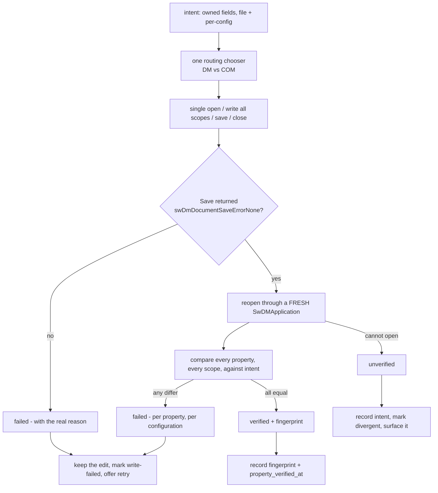

# Metadata source of truth

## Evidence standard used in this document

Every factual claim below is tagged.

| Tag | Meaning |
|---|---|
| **[read]** | I opened the file and read the code. Line numbers are from the working tree as of this writing. |
| **[measured]** | Someone ran it and recorded the result. Attributed to whoever measured it. |
| **[assumed]** | Not verified. Stated as an assumption so it can be challenged. |

An earlier plan in this project was wrong because it asserted a Document Manager limitation that measurement later disproved. Two consequences: nothing here is asserted without a tag, and **the audit brief that commissioned this plan is itself partly stale** - see [What contradicts the audit](#what-contradicts-the-audit).

Nothing in this document was measured by me. I ran no SolidWorks code and no database query. Everything tagged **[measured]** is inherited from `.cursor/plans/atomic-metadata-writes.plan.md` and `.cursor/plans/headless-reference-reads.plan.md` and is attributed as such.

---

## What contradicts the audit

The brief lists six confirmed findings. Checked against the working tree, four hold, one is stale, and one is understated. Three findings the audit does not mention are more serious than several it does.

| Audit claim | Verdict |
|---|---|
| `updatePendingMetadata` mutates `pdmData` with no rollback | **Holds** **[read]** `filesSlice.ts:642-656`. And it is worse than stated - see below. |
| Check-in promotes unverified `pendingMetadata` into the database | **Holds** **[read]** `checkin.ts:1139`, `checkout.ts:151-181`, comment at `checkin.ts:1121-1124` |
| Five disagreeing copies of the property key list | **Understated.** There are more than five, they disagree on more than the key list, and one **writer** disagrees with every reader. |
| `SolidWorksPanel`'s reader lacks the `$PRP:` guard | **Holds** **[read]** `SolidWorksPanel.tsx:1022-1027` - no `startsWith('$')` anywhere in that file |
| Read-after-write verification exists only in the diagnostic probe | **Holds** for properties **[read]**. But a content-hash drift check *does* exist at check-in - `detectPostCheckinDrift`, `checkin.ts:844-865` - and is a usable precedent. |
| Honest reporting is partial on the TypeScript side | **Holds, and the specific lines named are still live** **[read]** `syncMetadata.ts:929` and `:939-948` |

### Stale: much of the C# side is already fixed

The brief's framing implies the service still needs the phase B work from the atomic-metadata-writes plan. Most of it has landed **[read]**:

| Prior defect | Current state |
|---|---|
| `SwDmCustomInfoType` passed as `2` | **Fixed.** `SwDmConstants.cs:76` defines `Text = 30`; `DocumentManagerAPI.cs:216` resolves it by name |
| `InvokeAddCustomProperty` discards the bool | **Fixed.** `DocumentManagerAPI.cs:196-201` returns it, call sites increment `propsFailed` |
| `SetPropertiesBatchFast` does `Success = success > 0` | **Fixed.** `Program.cs:996-1016` reports `configurationsFailed` and `failedConfigurations` |
| `DocumentManagerAPI.SetCustomPropertiesBatch` has zero callers | **Fixed.** Called from `Program.cs:972` |
| COM writes report no per-property outcome | **Fixed.** `PropertyWriteReport` records Set2/Add3/Delete2 results |

This matters for phasing. The remaining honesty gap is **not** that the service lies - it is that the service now tells the truth into a TypeScript layer that discards it. `Program.cs:996-1016` returns `configurationsFailed`; **[read]** nothing in `syncMetadata.ts` reads that field. The fix is on the consuming side.

Two service-side gaps do remain **[read]**: partial failure still returns `Success = true` whenever at least one property or configuration landed (`DocumentManagerAPI.cs:1858-1867`, `Program.cs:1005-1016`, `SolidWorksAPI.cs:1384-1394`), and there is no read-back verification of properties anywhere in the service.

### Stale in the other direction: timeout retries are worse than the prior plan said

The atomic-metadata-writes plan flagged this as a renderer-level fallback. **[read]** It is more general: `solidworksErrors.ts:290-296` marks `TIMEOUT` retryable with no exclusion for mutating actions, and `solidworks.ts:1028-1037` re-issues the command up to `MAX_AUTO_RETRIES = 2`. A timed-out `setPropertiesBatch` can be issued three times against a file the first attempt may still be writing.

### Not in the audit, and the most damaging thing found

**1. Check-in erases configuration metadata for every configuration the user did not edit.** **[read]** This is active data loss on the success path.

`checkout.ts:155-160` builds the payload from pending state only:

```155:160:src/lib/supabase/files/checkout.ts
    if (options.pendingMetadata.config_tabs) {
      customPropsUpdate._config_tabs = options.pendingMetadata.config_tabs
    }
    if (options.pendingMetadata.config_descriptions) {
      customPropsUpdate._config_descriptions = options.pendingMetadata.config_descriptions
    }
```

`pendingMetadata.config_tabs` contains only edited configurations - `filesSlice.ts:610-616` merges new edits into prior *pending* edits, never into committed values. The RPC then merges with `||`:

```2264:2266:supabase/modules/10-source-files.sql
  -- Merge custom properties if provided (existing props + new props)
  IF p_custom_properties IS NOT NULL THEN
    v_merged_custom_props := COALESCE(v_file.custom_properties, '{}'::jsonb) || p_custom_properties;
```

`jsonb ||` is a **top-level** merge. `_config_tabs` is a top-level key, so the whole map is replaced. Edit one configuration's tab on the 68-configuration fixture, check in, and the other 67 committed tabs are gone from the database. The comment on line 2264 says "existing props + new props" and is wrong about nested objects.

I have not run this **[assumed]** - it is read from code and from documented `jsonb ||` semantics. It should be the first thing the phase 0 scanner confirms, because if true it is both a live bug and a likely cause of existing diverged rows.

**2. Two overlay call sites have reversed precedence, and the `pdmData` mutation is currently hiding them.** **[read]** The pending-over-committed overlay is hand-rolled in fourteen places with four different semantics. Two of them read committed first:

```398:401:src/features/source/browser/components/ContextMenu/actions/ExportActions.tsx
        const drawingPartNumber =
          drawing.pdmData?.part_number || drawing.pendingMetadata?.part_number || ''
        const drawingDescription =
          drawing.pdmData?.description || drawing.pendingMetadata?.description || ''
```

Same shape at `useConfigHandlers.ts:1094`. These are latent today **precisely because** `updatePendingMetadata` copies the pending value into `pdmData` - both branches return the same string. **Deleting the `pdmData` mutation without unifying the overlay first turns two latent bugs into live ones.** This is a hard ordering constraint on the whole plan.

**3. `pendingMetadata` is load-bearing for diff status, not just display.** **[read]** `useLoadFiles.ts:973-976` forces `diffStatus = 'modified'` whenever pending is non-empty, and `src/lib/pendingMetadata.ts` exists solely to strip pending values that already match committed, because otherwise a file is marked as needing check-in forever. Any change to the pending shape has to keep that invariant. The existing `dropCommittedPendingMetadata` is the right idea and should be extended, not replaced.

---

## 1. Ownership

### The model

**The database is the authoring system of record. The SolidWorks file is a published projection of it. Drawings are the exception, and reference documents are a projection of their model.**

This is not a new invention. It is what the code already claims **[read]** `syncMetadata.ts:12-14` and `:1227-1260`:

```1227:1233:src/lib/commands/handlers/syncMetadata.ts
        // For parts/assemblies: Only refresh REVISION from file
        // BluePLM is the source of truth for part_number, tab_number, and description.
```

The problem is that nothing enforces it. `SolidWorksPanel.tsx:998-1048` **[read]** does the opposite for the same file type - reads properties out of the file and writes them into the database - so the same part has two paths with opposite ownership depending on which panel the user happens to be in.

### Why the database owns the part number

The brief asked me to check this rather than assume it. **[read]** Confirmed, for parts and assemblies:

- Part numbers are **allocated** by an org-level atomic counter - `get_next_serial_number(p_org_id)` at `supabase/modules/10-source-files.sql:2488-2555`, taking `FOR UPDATE` on the organizations row and incrementing `serialization_settings.current_counter`. There is no equivalent authority inside a SolidWorks file.
- They are **authored** in BluePLM - `DetailsPanel.tsx:591-604`, `ItemNumberCell.tsx:150-201`, `FileCardMetadata.tsx:190-214`.
- They are **not** seeded from the file on first upload - `sync.ts:297-307` reads pending then committed, with the comment "Auto-extraction from SW files removed for performance".
- They are **not** derived from the filename - `parsePartNumber` in `serialization.ts:484-547` splits an existing number into base and tab; it does not parse filenames.

So the file cannot be the source of truth for a value the file has no way to allocate. A part number in a `.sldprt` is a **copy**, placed there so the number appears in title blocks and BOM tables.

Drawings genuinely reverse this **[read]** `syncMetadata.ts:1183-1201` pulls part number and description from the drawing or its parent. That is correct and should stay - but only because a drawing's part number is a projection of its **parent model's**, which is database-owned. The drawing is a projection of a projection.

### The ownership table

| Field | Scope | Owner | On disagreement |
|---|---|---|---|
| `part_number` | model, file-level | **Database** | Database wins. File is rewritten. Divergence is a defect, reported. |
| `part_number` | model, per-config | **Database** (base + `_config_tabs`) | Database wins. |
| `part_number` | drawing | **Parent model's database row** | Parent wins. Drawing rewritten. Drawing's own value is never promoted to the database as authoritative. |
| `description` | model, file-level | **Database** | Database wins. |
| `description` | model, per-config | **Database** (`_config_descriptions`) | Database wins. Absent means absent - never inherit file-level on write. |
| `revision` | model | **Database / workflow** | Database wins. Org policy `allow_file_level_revision_for_models` defaults false **[read]** `core.sql:154`, so the field is usually not even editable. |
| `revision` | drawing | **The drawing file** | File wins. `pushDrawingMetadata` deliberately never writes it **[read]** `syncMetadata.ts:1012-1015` - the drawing's revision table is authoritative. Keep this. |
| `revision` | per-config | **Database** (`configuration_revisions`) | Database wins; written by drawing release propagation. |
| Everything else (`Material`, `Weight`, `Volume`, `DrawnBy`, `Date`, …) | any | **The file** | File wins. BluePLM caches them in `custom_properties` for search and display and must never write them back. |

Two things fall out of this table that are worth stating plainly.

**`Volume` and `Weight` are file-owned and hold `$PRP:`-shaped values.** **[measured]**, per the atomic-metadata-writes plan, the ORING fixture carries `"SW-Mass@ORING-BUNA-70A.SLDPRT"` in those properties. Any reader without the guard has live inputs to trip on. That is why the guard belongs in the contract rather than in each reader.

**"Database owns it" does not mean "silently overwrite the file".** It means: when they disagree, the repair direction is database-to-file, and the disagreement is *reported* before it is repaired. A user who typed a description directly into SolidWorks has done something the ownership model does not support, and deserves to be told, not to have it silently reverted. See [phase 7](#phase-7---reconcile-and-repair-existing-damage).

**Divergence is already escaping into deliverables.** **[read]** `syncMetadata.ts:1005-1010` records that PDF export reads the drawing's properties directly and *prefers them over BluePLM's value*, so a drifted drawing produces both a misnamed PDF and a wrong title block. This is the strongest argument against treating divergence as cosmetic: the file's copy, not the database's, is what reaches the customer.

### Decision needed: `Description` - custom property or native field

**[read]** `SolidWorksAPI.cs:1639` and `DocumentManagerAPI.cs:1970` expose the **native** `Configuration.Description`. Every writer in the codebase writes the **custom property** `Description`; nothing ever sets the native field. `useConfigHandlers.ts:1305-1309` re-reads the custom property and ignores the native value that `getConfigurations` already returned.

Recommendation: **the custom property is authoritative**, the native field is read-only context. It matches every existing writer, so it needs no data migration. But it is a real choice with a downside - SolidWorks' own configuration manager shows the native field, so a user editing description there will not affect BluePLM. Flagged as [decision D3](#decisions-you-need-to-make).

---

## 2. The write path

### The three-state outcome

The single most important primitive in this design:

```
type PropertyWriteOutcome = 'verified' | 'failed' | 'unverified'
```

- **`verified`** - written, and read back through an independent path, and equal to intent.
- **`failed`** - the write did not land, and we know it.
- **`unverified`** - the write may have landed. We could not confirm it. **This is not a success.**

**No layer may upgrade an outcome.** Today three layers do: the service returns `Success = true` on partial config failure, `syncMetadata.ts:929` only fails when *every* configuration failed, and `syncMetadata.ts:939-948` catches the exception and sets `writeSucceeded = true` anyway. Each is individually defensible and together they turn "12 of 68 configurations were written" into a green toast.

`unverified` is the state the current design has no vocabulary for, which is why everything collapses into success. It is the honest answer whenever the file was written but could not be re-read - and it is the state that check-in must be able to record rather than resolve.

### What a verified write looks like



**Where verification lives: in the C# service, inside the same command.** It cannot live in TypeScript, because TypeScript would have to issue a second `getProperties` command that the queue may reorder, that another writer may interleave with, and that would go through the same cache. It must be in the service so the read-back is bracketed by the write.

**Why a fresh `SwDMApplication` and not just a fresh document handle:** asking the layer that performed the write whether the write worked is exactly the failure mode that let the info-type bug survive three releases. **[measured]**, per the atomic-metadata-writes plan, the probe already does this - it re-reads through a second Document Manager application and cross-checks the file's SHA-256. `VerifyDrawingReference` at `DocumentManagerAPI.cs:2814` **[read]** already establishes the pattern for reference rewrites. Generalise it; do not invent it.

Three signals, all required for `verified`:
1. `Save()` returned `swDmDocumentSaveErrorNone`.
2. The file's SHA-256 changed (or the write was a genuine no-op, which must be distinguished).
3. Read-back through a new application equals intent, property by property, scope by scope.

**Never touch the SolidWorks UI to verify.** When the document is already open in SolidWorks, verify through the handle already held. Opening a window to check a write is not acceptable.

### Cost

**[assumed]** - and this is the largest unmeasured quantity in the plan. A verified write is one extra open-and-read cycle per file. **[measured]**, per the atomic-metadata-writes plan, all 68 configurations of the fixture can be written in a single open/save cycle, so the read-back should likewise be a single open/read cycle covering all scopes - meaning verification roughly doubles the cost of a write rather than multiplying it by the configuration count.

That must be measured before phase 4 ships, not assumed. Phase 0 adds the harness. If it turns out that read-back is expensive, the fallback is not to skip verification - it is to make verification asynchronous and let the row sit in `unverified` until it completes, which the three-state model already accommodates.

### When SolidWorks and Document Manager are both unavailable

Then the write cannot be attempted, so there is nothing to verify. `failed`, with the reason. The interesting case is narrower: **the write was attempted and we cannot confirm it.** That is `unverified`, and it happens when the process dies between save and read-back, when the file is locked by something else immediately after the save, or when the Document Manager licence is available for the write and not for the re-read.

`unverified` must be persisted, not just displayed, because the process may not survive to display it. That is what `property_verified_at IS NULL` alongside a non-null intent means in [phase 5](#phase-5---fingerprint-and-drift-visibility).

### Routing and the retry hazard

The DM-vs-COM chooser is **not** designed here. **[read]** It is specified in `.cursor/plans/headless-reference-reads.plan.md` step 5 and in the atomic-metadata-writes plan phase E1, and both correctly note it is one component, not two. This plan consumes it. Do not build a third.

One thing this plan does own, because it is a correctness hazard for verified writes specifically: **a mutating command must not be retried on timeout.** **[read]** `solidworksErrors.ts:290-296` and `solidworks.ts:1028-1037`. Either wait for the original to be confirmed dead, or carry an idempotency token the service deduplicates on. A retried write against a file the first attempt is still saving can produce a genuinely corrupt file, and no amount of read-back verification helps if two writers are racing.

---

## 3. Optimistic UI without lying

### The rule

**`pdmData` is what the server said. `pendingMetadata` is what the user asked for. Nothing may write the second into the first.**

Three places break this **[read]**:

| Where | What it does |
|---|---|
| `filesSlice.ts:642-656` | `updatePendingMetadata` copies pending into `pdmData` on every keystroke-commit |
| `filesSlice.ts:687-697` | `clearPendingMetadata` merges pending into `pdmData` before clearing |
| `useLoadFiles.ts:935-938` | merges `preservedPending` into `finalPdmData` on every vault load |

Each has the same motive, stated in each comment: make the edit show up immediately. That motive is correct. The mechanism is not - it destroys the distinction between "the server has this value" and "the user typed this value", and the second one is the one that might be a lie.

### The mechanism: overlay at render, not at write

The brief asks whether pending values should live only in `pendingMetadata` and be overlaid at render time. **Yes** - and the codebase has already half-built it. **[read]** `ItemNumberCell.tsx:203-207`:

```203:207:src/features/source/browser/components/FileList/cells/ItemNumberCell.tsx
  // Prioritize pendingMetadata over pdmData - pending edits should always show
  const displayValue =
    file.pendingMetadata?.part_number !== undefined
      ? (file.pendingMetadata.part_number ?? '-')
      : file.pdmData?.part_number || '-'
```

That is the correct shape - `!== undefined` so an intentional clear to `null` is honoured rather than falling through. It is repeated, with four different semantics, in fourteen places:

| Semantics | Sites | Problem |
|---|---|---|
| `pending !== undefined ? pending : committed` | `ItemNumberCell:203`, `DescriptionCell:67`, `FileCardMetadata:42`, `ExportActions:145` | Correct |
| `pending ?? committed ?? ''` | `DetailsPanel:286-292`, `useFileEditHandlers:272-281`, `fileOps:125-127`, `assert:217-241`, `sync:302-305` | A pending clear to `null` falls through to the committed value |
| `pending \|\| committed \|\| null` | `useConfigHandlers:151-160`, `:222-224` | A pending clear to `''` falls through |
| `committed \|\| pending` | `ExportActions:398-401`, `useConfigHandlers:1094` | **Precedence reversed** |

**Ordering constraint, restated because it governs the whole plan:** the `pdmData` mutation currently makes all four produce identical output. Unify the resolver first (phase 2), remove the mutation second (phase 3). Reversing that order ships two regressions.

### The shape

One resolver, in `src/lib/metadata/` alongside the contract, returning value **and** provenance:

```typescript
type FieldProvenance =
  | 'committed'        // server value, no pending edit
  | 'pending'          // edited, write not yet attempted
  | 'writing'          // write in flight
  | 'unverified'       // written, could not confirm
  | 'write-failed'     // write refused or read-back mismatched

interface ResolvedField {
  value: string | null
  provenance: FieldProvenance
}
```

`PendingMetadata` gains a per-field write state. **[read]** It is persisted (`pdmStore.ts:208` partializes `persistedPendingMetadata`) and **[read]** none of store migrations 2-11 touch it, so this needs store version 11 to 12 with a migration that defaults existing persisted entries to `'pending'`. Defaulting to `'pending'` rather than `'unverified'` is deliberate: on upgrade we genuinely do not know, and `'pending'` is the state that prompts a write attempt rather than a divergence report.

Zustand conformance **[read]** `zustand.mdc`: no new store. `PendingMetadata` is already in `src/stores/types.ts:178-191`; extend it there. The resolver is a pure function in `src/lib/metadata/`, not a hook, so it is callable from command handlers as well as components. A memoized `useResolvedMetadata(file)` selector goes in `src/stores/selectors.ts` per the rule that complex derived state lives there.

### What the user sees

| Provenance | Rendering |
|---|---|
| `committed` | normal |
| `pending` / `writing` | a dot or subdued marker - "not saved to the file yet" |
| `unverified` | a warning marker - "saved, could not confirm" |
| `write-failed` | an error marker with a retry affordance |

### Rollback: revert the lie, keep the edit

The brief asks for pending state to be "reverted on failure". Reverting has two possible meanings and they deserve to be separated:

- **Revert the optimistic `pdmData` mutation** - yes, unconditionally. That is the lie, and it is removed entirely in phase 3 rather than rolled back, because it should never have been written.
- **Discard the user's typed value on write failure** - **no.** Deleting what a user typed because a background write failed is data loss of exactly the kind this plan exists to prevent, and it is worse than the bug: the user watches their input vanish with no way to recover it.

So: on failure the value **stays** in `pendingMetadata`, marked `write-failed`, visibly, with a retry. Nothing is lost and nothing is claimed. This satisfies the brief's requirement - pending is never conflated with confirmed - without introducing a new way to lose work.

---

## 4. Check-in's role

### The trilemma, weighed

| Option | Cost |
|---|---|
| **Refuse** to promote unverified pending | The user edits metadata, the file write silently fails, and their edits stop reaching the database forever. They have no reason to suspect it. This is the brief's own objection and it is correct - it is data loss with a longer fuse and a worse discovery story than the current bug. |
| **Promote silently** (current) | File and database diverge permanently and invisibly. The UI shows the database's value, so the divergence is undiscoverable from inside the app. |
| **Warn only** | Better than silent, but a toast during an 80-file batch check-in is not a record. The user dismisses it and the divergence persists with nothing durable pointing at it. |
| **Write, then promote, and mark what could not be verified** | Costs a write at check-in for files that have pending metadata. |

### Recommendation

**Check-in attempts the verified write for files that actually have pending metadata, promotes the value either way, and records the outcome on the row.** It never refuses and it never promotes silently.

Three reasons.

**Check-in is the last moment the file is writable.** **[read]** `checkin.ts:1227-1248` sets the file read-only as part of check-in, and `fs.ts:2407` (per the atomic-metadata-writes plan) marks every unchecked-out vault file read-only. After check-in, writing the file requires a check-out. Deferring the write past check-in guarantees a window where the database and the file disagree and nothing can fix it without a new check-out.

**Promotion is not the problem; unrecorded promotion is.** The database value is what BOMs, exports and the API consume. Withholding a user's edit from it to punish a failed file write helps nobody. What was missing was any durable record that the value had never been confirmed against the file - which is exactly what `property_verified_at IS NULL` provides.

**The cost is proportional to edits, not to files.** The obvious objection is performance: **[read]** `checkin.ts:1121-1124` explicitly does not write SolidWorks files, and check-in is batched across many files with a fast path. But **[read]** `checkin.ts:1139` shows only files with `file.pendingMetadata` have anything to write. A batch of 80 files where 3 were edited pays for 3 writes. Files with no pending metadata take the existing fast path untouched.

### The behaviour change users will notice

Checking in a file whose metadata you edited will be slower than it is today, by roughly one SolidWorks or Document Manager write-and-verify cycle. **[assumed]** - the magnitude depends on the phase 0 measurement, and on whether the file is already open in SolidWorks. Flagged as [decision D4](#decisions-you-need-to-make); if unacceptable, the fallback is to make the check-in write opt-out per organization, with the row marked `unverified` when it is skipped. The three-state model makes that a configuration choice rather than a redesign.

---

## 5. Drift detection and reconciliation

### The fingerprint

Two columns on `files`. Each justified individually, per the constraint that every schema change must be.

| Column | Type | Justification |
|---|---|---|
| `property_fingerprint` | `TEXT` | The hash of the file's owned-property state at the last successful verification. Without a stored value there is nothing to compare a later read against, so divergence can only be found by a full re-read of every file - which is the reason it is never found today. Mirrors the existing `inspection_hash` pattern **[read]** `10-source-files.sql:344-395`, which is precedent for exactly this: a TEXT fingerprint of derived state stored beside the row. |
| `property_verified_at` | `TIMESTAMPTZ` | Distinguishes *never verified* from *verified and since diverged*. Without it, `NULL` fingerprint conflates "legacy row" with "write failed", and those need opposite treatment. |

**No third column.** Divergence state is derived, not stored:

| `property_fingerprint` | vs. file re-read | Meaning |
|---|---|---|
| `NULL` | - | Never verified. Every row in production today. Not a defect - an unknown. |
| set | equal | Agrees. |
| set | differs | **Diverged since verification** - something changed the file outside BluePLM. |
| set, `property_verified_at IS NULL` | - | Intent recorded, verification never completed. The `unverified` case. |

Storing derived state invites it going stale. Deriving it costs one comparison.

**What the fingerprint covers:** a canonical serialization of the contract's **owned** key set, at file scope and every configuration scope, sorted by scope then key. Only owned keys - including `Material` or `Weight` would make every rebuild look like divergence, since **[read]** those are file-owned and SolidWorks recomputes them. Configuration scope must be included or the 68-configuration case is invisible, which is the whole problem.

**Not `file_versions`.** **[read]** `10-source-files.sql:463-480` snapshots `part_number` and `description` but not `custom_properties`. Adding the fingerprint there is tempting for history, but the fingerprint describes the *file on disk*, which versions do not capture. Out of scope; revisit if history of divergence proves necessary.

Schema 86 to 87. **[read]** Current: `core.sql:45-51` and `schemaVersion.ts:29` both at 86. Both bump together per `always.mdc`. **[read]** There is no `supabase/schema.sql` and no `supabase/migrations/` - the schema is idempotent modular SQL re-run by hand (`supabase/README.md:23-43`), so the change is an exception-guarded `ALTER TABLE ... ADD COLUMN IF NOT EXISTS` in `10-source-files.sql`. **This corrects a path in `always.mdc`**, which names `supabase/schema.sql`; flagged as [decision D6](#decisions-you-need-to-make).

### Existing damage

**The brief is right that diverged rows very likely already exist in production, and this design makes that assumption structurally safe:** every existing row gets `property_fingerprint = NULL`, which means *unknown*, not *clean*. No migration invents a fingerprint from data it cannot verify. The unknown state is resolved only by actually reading the file.

Detection is a vault scan that, per file, reads the owned properties, compares against the row, and classifies:

| Class | Condition | Repair |
|---|---|---|
| **Agrees** | file matches database on every owned field | Write the fingerprint. Done. |
| **File empty** | database has a value, file has none | Auto-repairable. Write the file. The commonest shape of the info-type bug's damage. |
| **Database empty** | file has a value, database has none | Auto-repairable **for drawings** (file-owned). **Needs a decision for models** - it means someone authored in SolidWorks. |
| **Both set, differ** | genuine conflict | **Needs a decision.** Never auto-repaired. |
| **Config map truncated** | file has configurations the database's `_config_tabs` does not mention | Likely the `jsonb \|\|` wipe. Auto-repairable *into* the database if the file's value is non-empty and the database's key is absent. |

The last row is the one that recovers damage from the merge bug, and it is only recoverable **because the file still has the values** - the wipe destroyed the database's copy, not SolidWorks'. That is a genuine piece of luck and it argues for running the scan before anything else overwrites files from the database.

**Ordering consequence:** the scan is read-only and must ship in phase 0, before any phase that writes files from database values. If phase 8's push runs first on a diverged vault, it overwrites the file's evidence with the database's possibly-wrong value and the damage becomes unrecoverable. This is the single most important sequencing constraint in the plan after the overlay ordering.

**Genuine conflicts need a human.** No heuristic distinguishes "the file is stale because a write failed" from "the file is right because someone edited it in SolidWorks". **[read]** `file_versions` snapshots `part_number` and `description` per version and can *inform* the choice - if the file's value matches an older version's, the file is probably stale - but it cannot decide it. The reconcile UI presents both values, the version history, and the timestamps, and the user chooses. Bulk "prefer database for all models" is offered because on a large vault it is the realistic answer, but it is never the default.

---

## 6. One property contract

### Scope

**[read]** The disagreements are worse than a key list. Across TypeScript and C# there are five independent read-priority lists, four different write sets, three different `$PRP:`/`$` conventions, and two different tab-derivation rules. Selected evidence:

- **A writer disagrees with every reader.** `SolidWorksPanel.tsx:1083-1091` writes **only** `Base Item Number`. Every reader ranks `Number` first. **[measured]**, per the atomic-metadata-writes plan, the fixture carries both set to the same value, so this is latent - it becomes live the moment they differ, which is the moment someone uses this panel and any other path in either order.
- **A dead reader inverts the priority.** `DocumentManagerAPI.cs:3503-3559` `GetPartNumber` ranks `Base Item Number` **first**. **[read]** Zero callers. It is a landmine, not a bug - delete it.
- **The guard is applied three different ways.** `syncMetadata.ts:336,348,371,382` rejects `startsWith('$')` on read; `DetailsPanel.tsx:387,430` treats a `$` value as a writable gap; `DocumentManagerAPI.cs:1033-1040` does a case-insensitive substring match on `PRP:`/`$PRP:`/`SW-PRP:`. `SolidWorksAPI.cs` `GetPartNumber`/`GetRevision`/`GetTabNumber` and `SolidWorksPanel.tsx:1022-1027` and `useConfigHandlers.ts:1305-1309` have **no guard at all**.
- **Tab derivation disagrees.** `useConfigHandlers.ts:1303-1328` ignores the `Tab Number` property entirely on load and parses the tab out of `Number`; `useConfigHandlers.ts:879` reads `Tab Number` on the propagate path. The same hook uses two rules.

### The shape

A single **data** file, `shared/property-contract.json`, not a TypeScript module:

```
shared/property-contract.json     <- the only definition
src/lib/metadata/contract.ts      <- typed import + helpers (TS consumers)
solidworks-service/.../PropertyContract.cs  <- embedded resource loader (C# consumers)
```

Data rather than code because there are two languages. Generating C# from TypeScript at build time would work but adds a build step to a repo that does not have one for this, and it fails open - a stale generated file compiles fine. A shared JSON with a test asserting both loaders produce identical key lists fails closed.

The contract owns:

- **Read priority per logical field**, one ordered list, replacing all five.
- **The write set per logical field and per scope** - which physical keys a write must produce. This is what resolves `Number` versus `Base Item Number`: both are written, `Number` carries the combined base-plus-tab value and `Base Item Number` carries the base. That is what `syncMetadata.ts:868-876` already does **[read]**; the contract makes it the only behaviour.
- **The `$PRP:` guard**, one definition. Recommend the broadest existing form - the C# substring match on `PRP:`/`$PRP:`/`SW-PRP:` - since it strictly subsumes `startsWith('$')` for these values and **[measured]** the fixture's `Volume`/`Weight` values are exactly the shape it catches. Note it is a *read* guard; `DetailsPanel`'s use of it to identify a writable gap is a distinct rule and should be named separately in the contract rather than conflated.
- **Ownership**, from the table in section 1, so the fingerprint and the reconciler derive their key set from the contract instead of hardcoding one.
- **Scope rules** - which fields exist at file level, configuration level, or both.
- **The configuration-selection rule**, which today is a heuristic that **[measured]**, per the atomic-metadata-writes plan, picks the `XXX` template on all 11 fixture drawings. Per that plan's phase E3 the heuristic is **deleted**, not improved, in favour of `ISwDMView.ReferencedConfiguration`. That work belongs to the headless-reference-reads plan; the contract just declares the rule so there is one place it is stated.

`buildItemNumberProperties(base, tab, description, revision, settings)` becomes a contract function every writer calls. `DetailsPanel`, `SolidWorksPanel`, `syncMetadata` and `useConfigHandlers` route through it, which is the same set the atomic-metadata-writes plan phase D named.

Style conformance **[read]** `style.mdc`: named exports, `interface` for shapes and `type` for unions, canonical types in `src/types/` with features narrowing rather than redefining, no magic strings, no `any`.

---

## 7. Configuration-level metadata

68 configurations **[measured]**, per the atomic-metadata-writes plan, on `ORING-BUNA-70A.SLDPRT`. Configuration scope multiplies every other section, and it is where the two worst defects live.

| Concern | At file scope | At configuration scope |
|---|---|---|
| Fingerprint | one hash | must cover all 68 or divergence is invisible - one canonical serialization over all scopes, not 68 hashes |
| Verification | one read-back | one read-back covering all scopes; **never** 68 open/read cycles |
| Write | one property set | **only changed configurations** |
| Storage | columns | `custom_properties._config_tabs` / `._config_descriptions`, currently wiped on partial update |
| Reads on expand | one call | **[read]** `useConfigHandlers.ts:1286-1347` issues up to 1+N `getProperties` calls; 69 IPC round trips through a queue with `SW_MAX_CONCURRENT_COMMANDS = 1` |

Two defects specific to this scope, beyond the JSONB wipe already covered:

**`pushPartAssemblyMetadata` writes all 68 configurations from a pending-only set.** **[read]** `syncMetadata.ts:858-888` builds `batchProps` for every configuration, taking each one's description from `configDescs[config.name] ?? fileDescription`. A configuration with a valid config-specific description and no pending edit is overwritten with the file-level description. Editing one configuration rewrites all 68. Contrast `useConfigHandlers.ts` **[read]**, which writes only `changedConfigNames` - the correct behaviour, in the other hook.

**Loaded configuration values have no provenance, and the guesses are written back.** **[read]** `useConfigHandlers.ts:1303-1328` derives a description by merging file-level and config-level properties and derives a tab by splitting `Number`. Those derived values reach the save path at `:784-791`, where `config.description ?? baseDesc` substitutes the file-level description when the config-level one is empty. A read-modify-write cycle whose read is a heuristic converges on the heuristic's output. **[measured]**, per the atomic-metadata-writes plan, the fixture has file-level `Description` and config `-265`'s `Description` both set to `O-ring, NBR 70A, Family`, differing only in `Tab Number` - so a merge-on-read cannot distinguish "inherited" from "set deliberately", and the observed "description reverts to the parent's" behaviour follows directly.

The fix in both cases is the same and it is the contract's job: **a loaded value carries where it came from, and only file-sourced values are eligible to be written back.** An absent configuration description stays absent.

---

## Phasing

Every phase is independently shippable and leaves the app working. Two hard ordering constraints, both derived above:

1. **Phase 2 before phase 3.** Unifying the overlay must precede removing the `pdmData` mutation, or two reversed-precedence sites become live bugs.
2. **Phase 0's scanner before any phase that writes files from database values.** The files still hold the evidence needed to recover from the JSONB wipe. Overwriting them first makes that damage permanent.

### Phase 0 - Evidence, before behaviour

No behaviour change. Nothing ships to users.

- Extend the `--dm-probe` harness with the property-contract fixtures the atomic-metadata-writes plan phase A3 specifies: a key existing at file scope but not config scope and vice versa, a value containing `$PRP:`, an empty value taking the delete path, and a write attempted with the read-only attribute set.
- **Measure the cost of read-back verification** on the 68-configuration fixture. This is the number phase 4 is designed around and it is currently assumed.
- Add a **read-only divergence scanner** reporting, over the real vault: how many rows disagree with their file per field, how many `_config_tabs` maps are missing configurations the file has, and the distribution across the five classes in section 5. This is the measurement that tells us the size of the existing damage. It writes nothing.
- Confirm or refute the `jsonb ||` wipe against a real row.

Deliverable: a divergence report. Everything after this is calibrated by it.

### Phase 1 - Stop the active data loss

The only phase that is purely a bug fix, and it is first because it is losing data right now.

- Change `checkin_file` to deep-merge the reserved configuration maps instead of replacing them, or change `checkout.ts` to send the merged committed-plus-pending map. Prefer the RPC fix: it repairs every caller, including any future one, and the client cannot be trusted to reconstruct a map it does not fully hold.
- Schema 86 to 87 (`core.sql` + `schemaVersion.ts` together). Combine with phase 5's columns if the two ship close together, to avoid two version bumps for one release.
- Fix the comment at `10-source-files.sql:2264` that claims a merge it does not perform.

### Phase 2 - One overlay resolver

No intended behaviour change except at the two reversed sites.

- Add `resolveMetadataField` and `useResolvedMetadata` in `src/lib/metadata/` and `src/stores/selectors.ts`.
- Route all fourteen call sites through it. The two reversed-precedence sites change behaviour: pending now wins, as it does everywhere else.
- Extend `dropCommittedPendingMetadata` rather than replacing it - it already encodes the pending-equals-committed invariant that `useLoadFiles.ts:973-976` depends on.

### Phase 3 - Pending is pending

The behaviour change users see most directly.

- Delete the `pdmData` mutation from `updatePendingMetadata` and `clearPendingMetadata`, and the merge in `useLoadFiles`.
- Add per-field write state to `PendingMetadata`; store version 11 to 12, existing entries default to `'pending'`.
- Render the four provenances distinctly.
- On write failure: keep the value, mark `write-failed`, offer retry.

Users will notice that an edit now looks visibly unsaved until it is saved. That is the point, and it should be called out in the changelog as an intentional change rather than left to be discovered.

### Phase 4 - Verified writes

- Service returns a per-property, per-configuration verification report from a read-back through a fresh `SwDMApplication`, cross-checked against the file hash and the save result code.
- Partial failure is failure. Fix `syncMetadata.ts:929` and the catch at `:939-948`. Consume `configurationsFailed` and `propertiesFailed`, which the service already returns and nothing reads. Stop `DetailsPanel.tsx:435-441` discarding the config-level result. Stop `syncMetadata.ts:1465-1543` counting a null drawing pull as success.
- Stop retrying mutating commands on timeout.
- Bump the SolidWorks service version with a description entry.

### Phase 5 - Fingerprint and drift visibility

- `property_fingerprint` and `property_verified_at` on `files`. Schema bump (or folded into phase 1's).
- Every verified write records both. Every unverified write records intent and leaves `property_verified_at` null.
- Surface divergence in the UI. Existing rows show as *unknown*, not clean.

### Phase 6 - Check-in writes, then promotes

- For files with pending metadata: attempt the verified write, then promote. Files without pending metadata keep the existing fast path untouched.
- Promote regardless of outcome; record the outcome on the row.
- Never refuse.

### Phase 7 - Reconcile and repair existing damage

- A `reconcile` command in `src/lib/commands/handlers/`, registered in `index.ts` per `always.mdc`.
- Classify per section 5. Auto-repair the two safe classes. Present genuine conflicts with both values, the version history and the timestamps.
- Recover truncated configuration maps from the file, which is where they survived.

### Phase 8 - Configuration scope at scale, and cleanup

- `pushPartAssemblyMetadata` writes only changed configurations, starting from what the file holds.
- Loaded configuration values carry provenance; heuristically derived values are never written back.
- Replace the 1+N `getProperties` fan-out on expand with a batch read.
- Delete the dead `DocumentManagerAPI.GetPartNumber`/`GetRevision` with their inverted priority.
- CHANGELOG entries, `npm run typecheck`, harness green with SolidWorks closed, with the part open in SolidWorks, and with the ROT broken.

---

## Relationship to the existing plans

This plan **supersedes** phases C5, D and parts of B4 of `.cursor/plans/atomic-metadata-writes.plan.md`, and **absorbs** C1 and C2 into phase 8. It does **not** duplicate:

| Work | Owner |
|---|---|
| The DM-vs-COM routing chooser | `headless-reference-reads.plan.md` step 5 / atomic-metadata-writes E1. One component. Consumed here. |
| `GetDrawingViewReferences` and `ISwDMView.ReferencedConfiguration` | `headless-reference-reads.plan.md` step 4. The contract declares the configuration-selection rule; that plan implements the read. |
| The vendor-enum assertion test | `headless-reference-reads.plan.md` step 1. **[measured]** it would have caught both prior constant bugs. Highest-value item across all three plans; should land before any of this. |
| Splitting `SolidWorksAPI.cs` (215 KB) and `DocumentManagerAPI.cs` (183 KB) | Deliberately out of scope in all three plans. Both are far past the "must be split before adding new functionality" tier in `style.mdc`. Phase 4 adds verification to `DocumentManagerAPI`; it should go in a new partial, as the reference plan does. |

Phases B1, B2 and C3 of the atomic-metadata-writes plan are **[read]** already implemented and its todo list is out of date.

---

## Decisions you need to make

| # | Decision | Recommendation | Why it needs you |
|---|---|---|---|
| **D1** | Is the database the owner of `part_number` and `description` for models, with the file as a projection? | **Yes** - it is what the code already claims and what the serialization counter implies | This is the load-bearing decision. Everything else follows from it. If you want SolidWorks to be authoritative, the whole design inverts. |
| **D2** | `SolidWorksPanel`'s "sync from file" path writes file values into the database for models, contradicting D1. Keep, remove, or turn into a reconcile action? | **Turn it into a reconcile action** that shows the difference and asks | It is a feature someone may rely on. Removing it silently is its own kind of data loss. |
| **D3** | `Description`: custom property authoritative, or native `Configuration.Description`? | **Custom property** - matches every existing writer, no migration | The native field is what SolidWorks' own configuration manager shows, so this choice determines whether editing there affects BluePLM. |
| **D4** | Check-in writes the file for edited files. Acceptable slowdown? | **Yes**, cost is proportional to edits not files | It reverses an explicit past decision (`checkin.ts:1121-1124`) that was presumably made for a reason. |
| **D5** | On genuine conflict during reconcile, offer a bulk "prefer database for all models"? | **Offer it, never default to it** | On a large vault, per-file adjudication may be impractical. Only you know the vault's size and how much SolidWorks-side authoring actually happens. |
| **D6** | `always.mdc` says schema changes go in `supabase/schema.sql`. **[read]** That file does not exist; the schema is `core.sql` plus modules. Update the rule? | **Yes** - update `always.mdc` | A rule that names a nonexistent file will keep misdirecting future work. |
| **D7** | Phase 0's scanner runs against production data before anything else. Confirm that is acceptable and when. | Run it read-only, first | It reads the whole vault through Document Manager. It is safe but not free, and it needs a quiet window. |

## Things I could not verify

Stated explicitly so they are not mistaken for findings.

- **The cost of read-back verification.** Assumed to be roughly one extra open/read cycle per file based on the atomic-metadata-writes plan's measurement that all 68 configurations write in one cycle. Not measured. Phase 0 measures it.
- **How many production rows have already diverged.** The brief says "very likely" and the mechanisms are read-in-code, but no scan has been run. Phase 0 is that scan.
- **Whether the `jsonb ||` configuration-map wipe has actually destroyed data in production.** The mechanism is read-in-code and the semantics are documented, but I have not observed a damaged row.
- **Whether `Configuration.Description` is populated on real parts.** The API exposes it; whether anyone's files use it is unknown, and it affects D3.
- **Whether anything outside this repository reads `files.custom_properties`.** The API at `api/` may expose it; if an integration depends on the current shape, phase 1's merge change needs an API version bump per `always.mdc`. Not checked.
- **The ORING fixture's 68 configurations and the `XXX` template.** Inherited as **[measured]** from the atomic-metadata-writes plan; not re-measured here.
