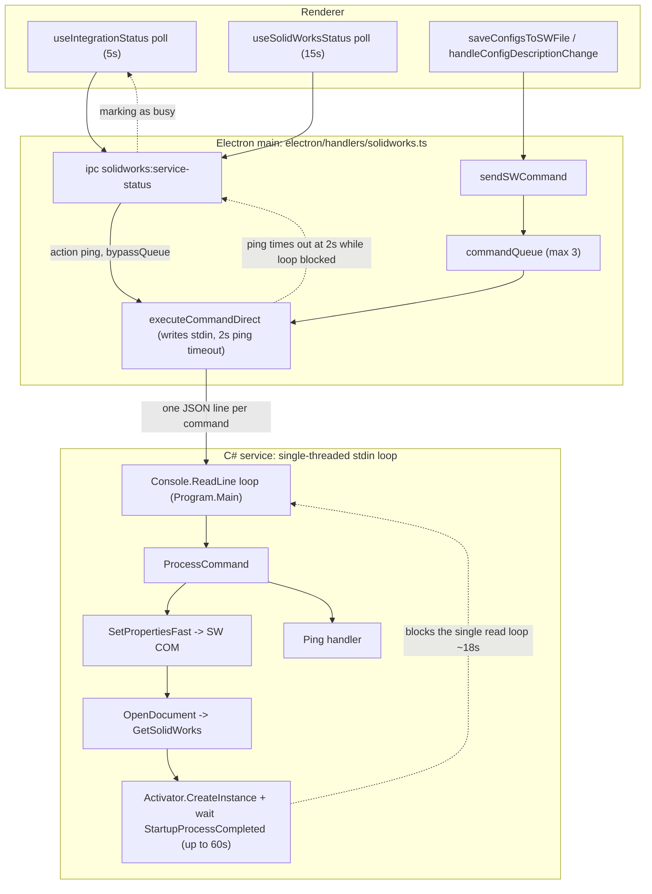

# SolidWorks Write Performance & Reliability — No-Regression Plan

## 1. Problem statement

A user (Blake) edited the **description** on `WLC ILR - RP ASSEMBLY.SLDASM` — a packed-assembly
family with ~13 configurations, ~966 KB. The metadata write (`setProperties`) took **17,986 ms**
the first time and **2,702 ms** the second time. Three independent root causes were confirmed in
the code:

1. **Cold start on the critical path (A).** `setProperties` is routed to the *full SolidWorks COM
   API* unconditionally (`Program.SetPropertiesFast`), which opens the document via
   `SolidWorksAPI.OpenDocument` → `GetSolidWorks()`. When no SW instance is in the ROT
   (`Marshal.GetActiveObject` → `MK_E_UNAVAILABLE`), `GetSolidWorks()` launches SolidWorks with
   `Activator.CreateInstance` and blocks up to 60 s for `StartupProcessCompleted`. The second write
   was fast only because SW was already warm.

2. **Ping retry-storm against a single serialized channel (B).** The C# service reads commands from
   stdin on **one thread** (`while ((line = Console.ReadLine()) != null)` in `Program.Main`) and
   runs `ProcessCommand` synchronously. So *every* command — including health pings — is serialized
   behind the in-flight write at the process boundary, independent of the in-process
   `ComStability.ExecuteSerialized` semaphore. Meanwhile two renderer pollers
   (`useIntegrationStatus` @ 5 s and `useSolidWorksStatus` @ 15 s) each call `getServiceStatus`,
   which pings with a 2 s timeout (`STATUS_PING_TIMEOUT_MS`). Pings "bypass the queue" on the
   Electron side but still block behind the long write on the C# read loop, so they time out at 2 s
   and the status handler logs `process alive but ping failed - marking as busy`, repeatedly
   (ids 71–77 in the log).

3. **Multi-config fan-out for a file-level-only change (C).** In `useConfigHandlers.saveConfigsToSWFile`,
   the "no configs loaded" branch, after a successful file-level write, runs a propagation block
   **whenever the file has a base item number** (`if (baseNumber)`), which re-reads all
   configurations (`getConfigurations`) and issues a `setProperties` write to **every** config to
   restamp `Base Item Number` + `Number`. For a description-only edit (base number unchanged), this
   pays a ~13× open/write/save cost for no functional benefit.

### Current flow (command / serialization / ping)



Key structural insight: the **true serializer is the single-threaded stdin read loop**, not
`ExecuteSerialized`. Any fix in B must reduce *how often pings are sent while a real op is in
flight*, because the C# side cannot answer them until the in-flight op returns.

---

## 2. Improvement directions

### Direction A — Avoid a SolidWorks cold start on the write critical path

#### A. Current behavior (exact)

- `Program.ProcessCommand` maps `setProperties` to `SetPropertiesFast`:

```676:682:solidworks-service/BluePLM.SolidWorksService/Program.cs
        static CommandResult SetPropertiesFast(string? filePath, System.Collections.Generic.Dictionary<string, string>? properties, string? configuration)
        {
            // Always use the full SolidWorks COM API for property writes.
            // The DM API's AddCustomProperty silently fails for config-level properties
            // on newer file formats, so we bypass it entirely.
            return _swApi!.SetCustomProperties(filePath, properties, configuration);
        }
```

- `SolidWorksAPI.SetCustomProperties` → `OpenDocument` → `GetSolidWorks()`, which cold-starts SW:

```300:325:solidworks-service/BluePLM.SolidWorksService/SolidWorksAPI.cs
            Console.Error.WriteLine("[SW-API] *** LAUNCHING SOLIDWORKS ***");
            ...
            _swApp = (ISldWorks)Activator.CreateInstance(swType)!;
            _weStartedSW = true;
            _swApp.Visible = false;
            _swApp.UserControl = false;
            ...
            while (!_swApp.StartupProcessCompleted && attempts < 120)
            {
                Thread.Sleep(500);
                attempts++;
            }
            ...
            Console.Error.WriteLine($"[SW-API] SolidWorks started successfully (took {attempts * 500}ms)");
```

- The **DM session** is already kept warm (lazy `Initialize`, only torn down by `releaseHandles`
  during folder moves). `keepSwRunning` defaults to `true` (`Program.Main`), so once SW is launched
  it persists for the session — meaning the cold start is a **once-per-session, first-edit** cost,
  not a per-edit cost.
- The DM API *can* write properties without launching SW (`DocumentManagerAPI.SetCustomProperties`,
  line 1278) and it already implements the same decisive-delete semantics as the SW path. The team
  intentionally bypassed it for writes because `AddCustomProperty` silently fails for
  **config-level** properties on newer formats — but file-level writes via DM are the historically
  reliable case.

#### A. Proposed changes (options, in preference order)

- **A1 (recommended, guarded): DM-first for file-level-only writes.** In `SetPropertiesFast`, when
  `configuration` is null/empty **and** the file is *not* already open in SW
  (`_swApi.IsFileOpenInSolidWorks` is false) **and** `_dmApi.IsAvailable`, attempt the write via
  `_dmApi.SetCustomProperties(filePath, properties, null)` first. On any failure, fall back to the
  existing `_swApi.SetCustomProperties` path. This removes the cold start for the most common edit
  (file-level description / number) without changing config-level behavior at all. Files to touch:
  `Program.cs` (`SetPropertiesFast` only).
  - This pairs naturally with C: a description-only edit becomes "DM file-level write, no SW, no
    fan-out".

- **A2 (alternative, opt-in): warm-up on intent.** Add a fire-and-forget `prewarmSolidWorks`
  command (new action in `Program.cs` + a thin `SolidWorksAPI.EnsureStarted()` wrapping
  `GetSolidWorks()` on a background task) that the renderer triggers when the user signals an
  imminent SW-requiring edit (e.g., focusing a config tab/description input on a `.sldprt/.sldasm`,
  or expanding configurations). The actual write still uses SW COM, but SW is already warm by save
  time. Files to touch: `Program.cs`, `SolidWorksAPI.cs`, `electron/handlers/solidworks.ts`
  (new IPC), `src/features/source/browser/hooks/useConfigHandlers.ts` (trigger).

- **A3 (not recommended): eager pre-warm on service start / integration online.** Launch SW hidden
  as soon as the SW integration comes online. Simplest conceptually but worst trade-offs (below).

#### A. Regression risks & mitigations

- **License consumption / seat lock (A2, A3).** Launching SW hidden consumes a SOLIDWORKS license
  seat for the whole session even if the user never edits. On floating-license sites this can deny a
  seat to a CAD user. *Mitigation:* prefer A1 (no SW launch at all for file-level writes); if A2 is
  used, make warm-up strictly on explicit edit intent, never on startup; never do A3.
- **File locking (A2/A3).** A hidden SW that has opened component files can hold handles and
  interfere with folder moves / external edits. *Mitigation:* A1 avoids this. The existing
  `releaseHandles` / orphan watchdog logic already handles DM-spawned processes; do not weaken it.
- **Config-level correctness regression (A1).** DM is unreliable for *config-level* writes — so A1
  must restrict DM-first to `configuration == null` only and must fall back to SW on failure.
  `handleConfigTabChange`/`handleConfigDescriptionChange` always pass a config name, so they keep
  using SW unchanged.
- **"File open in SW" conflict (A1).** If the user has the file open in SW, using DM on it can make
  SW close/foul the document. *Mitigation:* the existing `IsFileOpenInSolidWorks` check already
  gates this elsewhere (e.g., `GetPropertiesFast`); reuse it so DM-first only applies when the file
  is *not* open in SW. When it *is* open, keep the SW COM path (no cold start anyway, since SW is
  running).
- **STA / COM reentrancy.** A1 introduces no new threading — DM and SW calls remain on the same
  single service thread. A2's warm-up must run as a background `Task` that still funnels its actual
  COM work through the existing serialization, or it can race the read loop; given STA constraints,
  prefer launching via the existing `GetSolidWorks()` path executed on the normal command thread
  (i.e., warm-up is itself just another serialized command), not a side thread.
- **Compatibility with the sibling delete change.** DM's `SetCustomProperties` already deletes on
  empty values (lines 1341–1347, 1391–1397), so routing file-level writes through it preserves the
  cleared-vs-untouched semantics that `useConfigHandlers` now relies on.

#### A. Recommendation

**Do A1 with guards** (DM-first for file-level-only writes, file-not-open, DM-available, SW
fallback on any failure). It removes the dominant 17 s cold start for the most common edit with
minimal blast radius and is self-reinforcing with C. **Defer A2** unless A1 proves insufficient for
config-level edits, and then only as explicit warm-on-intent. **Do not do A3** (license/lock risk).
Note: A1 is a **C# change** that cannot be locally built here (`dotnet` not on PATH) — treat it as
higher-verification-cost and land it after B and C.

---

### Direction B — Stop health pings from retry-storming the serialized channel

#### B. Current behavior (exact)

- Two independent renderer pollers both end up pinging:
  - `useIntegrationStatus` — `POLLING_INTERVAL_MS = 5000`, calls `checkAllIntegrations` →
    integrations slice `solidworks` case → `getServiceStatus`.
  - `useSolidWorksStatus` — `POLLING_INTERVAL_MS = 15000`, calls `getServiceStatus` directly.
- `getServiceStatus` (`ipc solidworks:service-status`) pings with a short timeout and bypasses the
  Electron queue:

```2302:2325:electron/handlers/solidworks.ts
    // Ping with short timeout (2s) to avoid blocking status checks
    const result = await sendSWCommand(
      { action: 'ping' },
      { timeoutMs: STATUS_PING_TIMEOUT_MS, bypassQueue: true },
    )
    ...
    // If ping failed but process is alive, it's busy - not offline
    const isBusy = !result.success && processAlive
    if (isBusy) {
      log(
        `[SolidWorks] Status check: process alive but ping failed - marking as busy (queue: ${queueStats.queueDepth}, active: ${queueStats.activeCommands})`,
      )
    }
```

- `sendSWCommand` forces `bypassQueue` for `ping` (line 1043), so pings write straight to stdin —
  but the C# read loop is blocked by the in-flight write, so each ping just waits out its 2 s
  timeout. There is already a 1 s `PING_CACHE_TTL_MS` cache, but with two pollers and 2 s timeouts
  during an 18 s window it still produces a burst of failed pings.
- `useSolidWorksStatus` already has `pausePolling`/`resumePolling` driven by
  `isBatchSWOperationRunning`, but single (non-batch) writes like a description edit do **not** set
  that flag, so polling continues straight through the long write.

#### B. Proposed changes (precise)

1. **Suppress pings while a real operation is in flight (main process).** In the
   `solidworks:service-status` handler, before issuing the ping, check `getQueueStats()` /
   `activeCommandCount`. If `activeCommandCount > 0` (a non-ping command is executing) or
   `commandQueue.length > 0`, **skip the ping** and return a synthesized `busy: true` status using
   the cached version (`cachedServiceVersion`) and current `queueStats`. Rationale: an in-flight
   command is itself proof of liveness; no separate probe is needed and the probe cannot be answered
   anyway. This is the core fix and is entirely main-process-local.
   - Keep the existing OS-level `checkProcessExists(pid)` check first, so a genuinely dead process is
     still reported `running: false` even when `activeCommandCount` is stale.
2. **Single-flight the status ping.** Guard `service-status` so only one ping is outstanding at a
   time (a module-level `pendingStatusPing` promise that concurrent callers await). This collapses
   the 5 s + 15 s pollers (and the settings screen) into one probe and removes duplicate pings.
3. **Lengthen the busy-state cache.** When a status resolves to `busy`, extend the effective cache
   TTL (e.g., reuse the last result for a few seconds) so repeated pollers don't re-probe a known
   busy service every cycle.
4. **(Optional, renderer) drive existing pause API from single writes too.** Have
   `saveConfigsToSWFile` / `handleConfigDescriptionChange` set a short-lived "SW op in progress"
   signal (or reuse `isBatchSWOperationRunning`) so `useSolidWorksStatus` pauses during the write.
   This is belt-and-suspenders on top of (1); (1) alone is sufficient and is preferred because it
   does not depend on every call site remembering to flip a flag.

Files to touch: `electron/handlers/solidworks.ts` (status handler + a single-flight guard). Optional:
`src/hooks/useSolidWorksStatus.ts` and/or the integrations slice for (4). No C# change required.

#### B. Regression risks & mitigations

- **A genuinely hung SW is never detected (correctness hazard).** If we suppress pings whenever
  `activeCommandCount > 0`, a wedged operation could keep the status "busy" forever. *Mitigations:*
  (a) every command already has an operation-specific timeout in `executeCommandDirect`
  (`getOperationTimeout`/explicit `timeoutMs`), so a hung op resolves to a failure and
  `activeCommandCount` decrements — the next status cycle then pings normally; (b) bound the
  synthesized-busy duration (e.g., only suppress for up to N seconds of continuous in-flight time,
  after which allow a real ping through); (c) never suppress the OS-level `checkProcessExists`
  liveness check.
- **Status UI feels "stuck on busy."** Returning `busy: true` keeps the integration indicator from
  flipping to offline (current code already special-cases `busy` and does not downgrade status).
  Confirm `useSolidWorksStatus`'s `apiData.busy` branch (lines 147–157) still updates `queueDepth`
  so the UI reflects progress.
- **Single-flight deadlock.** The single-flight promise must always be cleared in a `finally`, and
  must not be held across the long write (it wraps only the ping, which is itself short-lived).
- **No new concurrency on the C# side.** This direction changes only when/whether Electron sends a
  ping; it does not touch the STA/COM model, so it introduces no COM reentrancy or deadlock risk.
- **Cross-cutting (checkin/checkout/thumbnails).** Those flows also go through `sendSWCommand`. The
  change only affects the *ping* path in the status handler, so it cannot starve or reorder real
  operations; it only removes redundant probes. The existing queue and per-op timeouts are
  unchanged.

#### B. Recommendation

**Do B first** — it is the lowest-risk, highest-immediate-value change (no C# build needed, removes
log noise and wasted 2 s timeouts, and makes the app feel responsive during *any* long SW op, not
just this one). Implement (1) + (2) + (3); treat (4) as optional polish.

---

### Direction C — Skip the all-configs propagation for file-level-only edits

#### C. Current behavior (exact)

In `useConfigHandlers.saveConfigsToSWFile`, the "single config or no configs loaded" branch runs a
full propagation **whenever a base number exists**, regardless of whether it changed:

```815:877:src/features/source/browser/hooks/useConfigHandlers.ts
                // After successful file-level write, propagate base number to ALL configs
                // This ensures drawings that reference specific configs get the updated base number
                if (baseNumber) {
                  try {
                    // Fetch all configurations from the file (includes properties for each config)
                    const configResult = await window.electronAPI?.solidworks?.getConfigurations(
                      file.path,
                    )
                    const allConfigs = configResult?.data?.configurations || []
                    ...
                      for (const config of allConfigs) {
                        ...
                          await writeProps(file.path, configProps, configName)
                        ...
                      }
```

`baseNumber` is computed as:

```697:700:src/features/source/browser/hooks/useConfigHandlers.ts
        const itemNumberEdited = pm.part_number !== undefined
        const descriptionEdited = pm.description !== undefined
        const baseNumber = itemNumberEdited ? pm.part_number ?? '' : file.pdmData?.part_number ?? ''
        const baseDesc = descriptionEdited ? pm.description ?? '' : file.pdmData?.description ?? ''
```

So `baseNumber` is truthy whenever the file *has* a part number, even on a description-only save —
triggering `getConfigurations` + a per-config `setProperties` for all ~13 configs.

#### C. Proposed change (precise)

Guard the propagation on **the base number actually having been edited in this save**, not merely
existing:

- Change the propagation condition from `if (baseNumber)` to
  `if (itemNumberEdited && baseNumber)`.

This uses exactly the cleared-vs-untouched distinction introduced by the sibling change
(`itemNumberEdited = pm.part_number !== undefined`). A description-only edit (`pm.part_number ===
undefined`) then skips the entire `getConfigurations` + 13-write loop, while an actual base-number
change still propagates to every config exactly as today. File to touch:
`src/features/source/browser/hooks/useConfigHandlers.ts` (one condition; optionally factor the
propagation into a small helper for readability — not required).

#### C. Regression risks & mitigations

- **Configs that DO reference the base number must still be restamped (correctness hazard).** This
  is preserved: when the base number is actually edited (`itemNumberEdited === true`), propagation
  still runs. We only skip it when the base number was *not* part of this save. The propagation's
  documented purpose is "drawings that reference specific configs get the updated base number" — only
  relevant when the base number changed.
- **Tab-only changes.** In this branch (no configs loaded) the file-level tab affects `Number`
  (base+tab) for the file level only, already written above the propagation block. Config-level tabs
  are handled in the *multi-config* branch (`configs.length > 0`), which this change does not touch.
  Note as a known, pre-existing limitation: if a user changes only a file-level tab on a
  not-expanded multi-config family, per-config `Number` restamping does not occur in this branch
  today either — out of scope; do not expand scope here.
- **Cleared base number edge.** If the base number is intentionally cleared
  (`itemNumberEdited && baseNumber === ''`), `itemNumberEdited && baseNumber` is false, so no
  propagation runs. That matches the file-level "emit empty so backend deletes" behavior just above;
  configs would retain their prior base stamp. This is an unusual operation on a multi-config family
  and is *not a regression* versus today for the common case — call it out for the user but do not
  add new clearing-propagation logic without explicit need.
- **Interaction with A1.** With A1, a description-only file-level write goes through DM and no longer
  cold-starts; with C it also no longer fans out. The two are independent and compose cleanly:
  C reduces *number of writes*, A1 reduces *cost per write path*.
- **Compatibility with the sibling change.** This change *depends on* the new `pm.part_number !==
  undefined` semantics and does not alter the empty-value delete behavior, so it is fully
  compatible.

#### C. Recommendation

**Do C** (single, well-targeted guard). It is the biggest reduction in *unnecessary SW work* for the
exact scenario in the log, is renderer-only (typecheckable locally), and is low risk given the guard
maps to the already-trusted edited/untouched distinction.

---

## 3. Sequencing (lowest-risk / highest-value first)

1. **B — ping suppression while busy + single-flight.** Main-process-only, no C# build, immediately
   removes the retry-storm and the 2 s wasted timeouts; improves responsiveness for *all* long SW
   ops. Safest first landing.
2. **C — guard the all-configs propagation.** Renderer-only, locally typecheckable, eliminates the
   ~13× write amplification for description/file-level-only edits. High value, low risk.
3. **A1 — DM-first for file-level-only writes (with SW fallback).** C# change (cannot build locally;
   needs `npm run build-sw-service` / CI), so land last with the most manual verification. Removes
   the dominant cold-start cost for the common edit. **Defer A2 (warm-on-intent) and reject A3
   (eager pre-warm).**

Rationale: B and C are reversible, narrow, and locally verifiable; A1 touches the write routing and
the COM/DM boundary, so it carries the highest verification cost and benefits from B+C already being
in place (smaller, cleaner change to reason about).

---

## 4. Verification strategy

### Automated / build
- **B and C (TypeScript):** `npm run typecheck` (`tsc --noEmit`) must pass; `npm run lint` for
  style. These are the authoritative local gates since `dotnet` may not be on PATH.
- **A1 (C#):** cannot be locally compiled here. Build via `npm run build-sw-service`
  (`scripts/build-sw-service.js`) or CI before release. Until then, rely on close code review of
  `SetPropertiesFast` and the DM/SW fallback path. Remember the release gate
  (`.cursor/rules/always.mdc`): bump `Program.SERVICE_VERSION` if service behavior changes (A1), and
  follow API/schema version rules if any IPC contract changes (none expected for B/C/A1 as scoped).

### Manual SW scenarios (run each before/after)
1. **Multi-config family edit (the repro):** edit description on a 10+ config assembly with a base
   number, configs *not* expanded. Expect: (C) no `getConfigurations` + no per-config write storm in
   logs; (A1) no `*** LAUNCHING SOLIDWORKS ***` when SW is cold and the file is not open; total time
   collapses toward the warm number.
2. **Base-number change on the same family:** edit the item/part number. Expect: propagation STILL
   runs and every config's `Base Item Number`/`Number` is restamped (no regression of the intended
   behavior).
3. **Per-config description/tab edit:** via `handleConfigDescriptionChange`/`handleConfigTabChange`
   (passes a config name). Expect: unchanged SW COM path, correct config-level write, cleared-vs-
   untouched delete semantics intact.
4. **Single part edit (no configs):** description on a `.sldprt`. Expect: A1 DM file-level write,
   no cold start; value persists and a cleared value is deleted (not resurrected).
5. **Cold start vs warm:** with SW fully closed, perform a file-level edit (A1 should avoid launch);
   then perform a config-level edit (should launch once, then stay warm).
6. **Busy responsiveness (B):** during a deliberately long op, confirm the status indicator shows
   `busy` (not `offline`), and logs show the ping is *skipped* (no `marking as busy` storm, no 2 s
   ping timeouts). Then confirm that *killing* the service is still detected as `running: false`
   (OS-level liveness check still works).
7. **Concurrent checkin/checkout + thumbnails:** kick off a checkin/checkout (and let thumbnail/
   preview/reference extraction run) while editing metadata. Expect: real operations still queue and
   complete; B only removed redundant pings; no reordering/starvation; no new orphan
   `__wgldummywindowfodder` processes left behind.
8. **Folder move during DM use:** confirm `releaseHandles` / orphan watchdog still releases DM file
   locks (A1 must not leave DM holding a write handle — it closes the doc in `finally`).

---

## 5. Explicitly NOT changing (and why)

- **The single-threaded C# stdin read loop (`Program.Main`).** Making the service multi-threaded /
  adding a separate fast lane for pings would let pings answer during a long op, but introduces
  serious STA/COM reentrancy and ordering hazards for an integration shared by checkin/checkout/
  thumbnail/reference extraction. B solves the symptom (send fewer pings) without this risk.
- **`ComStabilityLayer.ExecuteSerialized` / `SemaphoreSlim(1,1)` and `IMessageFilter`.** The COM
  retry/serialization layer is working as intended; the real serializer is the read loop. Leave it.
- **The decisive empty-value delete + cleared-vs-untouched logic (just landed)** in
  `DocumentManagerAPI.SetCustomProperties`, `SolidWorksAPI.WriteCustomProperties`, and
  `useConfigHandlers`. All three directions are designed to be compatible with it; do not touch it.
- **`keepSwRunning` default (`true`).** Keeping SW warm once started is correct; the problem is the
  *first* launch on the critical path, addressed by A1, not by changing the keep-alive policy.
- **The multi-config branch of `saveConfigsToSWFile`** (`configs.length > 0`). C targets only the
  "no configs loaded" propagation block; the multi-config branch already writes only changed configs.
- **The orphan-process watchdog and `releaseHandles` flow.** These guard against zombie SW processes
  and file-lock issues; A must not weaken them (another reason to prefer A1 over A2/A3).
- **DM-first routing for config-level writes.** Deliberately kept on the SW COM path because DM's
  `AddCustomProperty` is unreliable for config-level properties on newer formats. A1 restricts
  DM-first to file-level only.

---

## 6. Open questions for the user

1. **A1 scope:** OK to route *file-level-only, file-not-open-in-SW* writes through the DM API (with
   SW fallback), accepting that config-level writes keep using SW COM? This is the lever that removes
   the cold start for the common edit.
2. **Warm-on-intent (A2):** if A1 is not enough for config-level first edits, is an explicit,
   edit-triggered hidden SW warm-up acceptable given it consumes a license seat for the session?
   (Default recommendation: defer.)
3. **B suppression bound:** preferred maximum continuous "synthesized busy" window before forcing a
   real ping through (e.g., 30 s) so a wedged op can't mask itself indefinitely?
4. **C cleared-base edge:** for the rare case of *clearing* a base number on a multi-config family,
   do you want configs' base stamps cleared too (extra propagation), or is leaving them as-is
   acceptable (current plan)?
